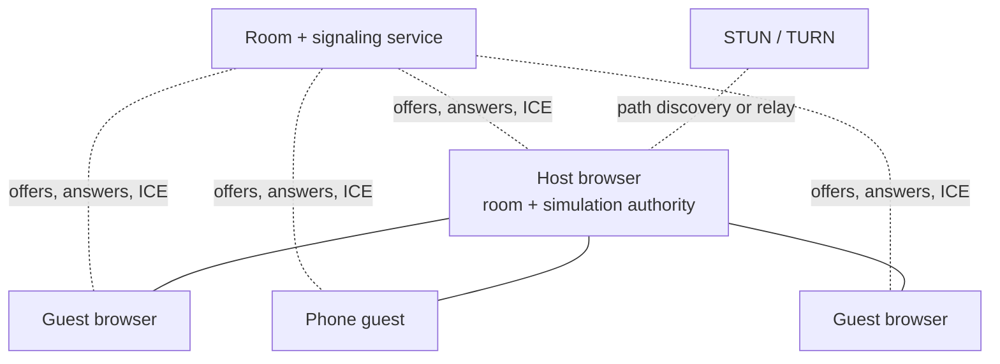
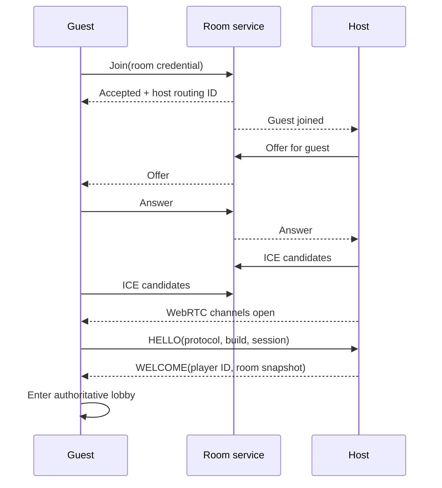
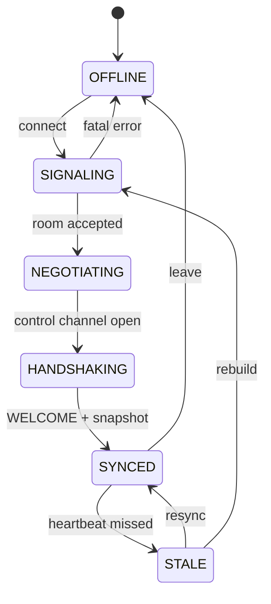
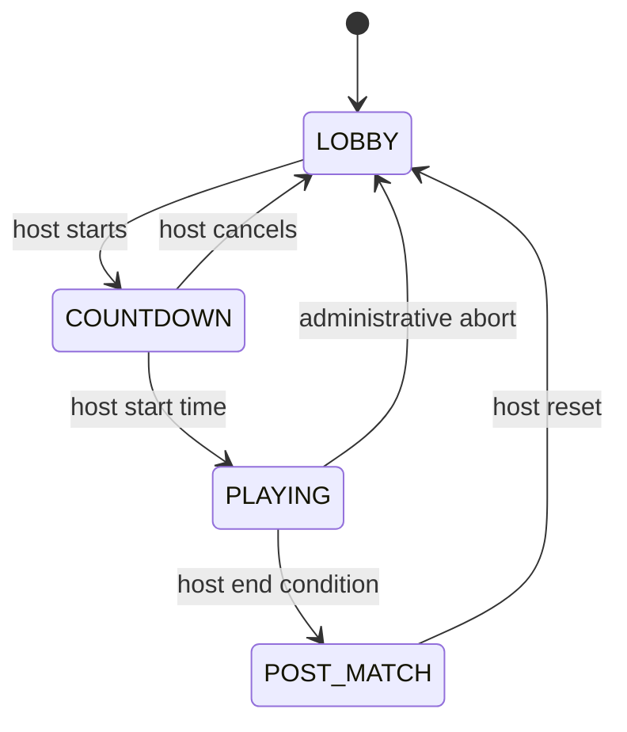

# Production Peer-to-Peer Networking for Browser Games

## Architecture, signaling, lobbies, match lifecycle, mobile clients, security, testing, and reference code

**Status:** implementation-ready reference specification  
**Version:** 1.0  
**Last updated:** 2026-07-30  
**Audience:** engineers and coding agents building small-session, real-time browser games

---

## 1. Executive summary

A browser game described as “peer to peer” still needs internet infrastructure. WebRTC carries game data between browsers, but a signaling service must first introduce those browsers, STUN helps discover reachable network paths, and TURN relays traffic when a direct path cannot be established. A production design should assume TURN will sometimes be used, that a phone will suspend the page, that messages can be delayed or duplicated by application-level retries, and that the host can disappear at any point.

For a casual game with roughly two to eight players, the recommended default is:

1. Use a **host-authoritative star topology**. Every guest has one WebRTC connection to the host. Guests do not directly trust or simulate authoritative results from one another.
2. Use a small **HTTPS/WSS signaling and room service**. It creates unguessable room credentials, introduces peers, enforces room capacity, and forgets disconnected sessions after a grace period.
3. Configure both **STUN and authenticated TURN**. Treat a relay-only test as a release gate.
4. Separate traffic into:
   - a reliable, ordered **control channel** for handshakes, lobby state, chat, match transitions, and durable gameplay events;
   - an unordered, short-lived **state channel** for inputs and snapshots where a newer packet supersedes an older one.
5. Make the room a formal, host-owned state machine:
   `LOBBY → COUNTDOWN → PLAYING → POST_MATCH → LOBBY`.
6. Do not show a guest as connected, allow gameplay, or run local prediction until a versioned `WELCOME` message has supplied the authoritative room snapshot and assigned player identity.
7. Send inputs to the host, not client-authored world state. The host advances a fixed-step simulation, validates inputs, resolves collisions and scoring, and emits snapshots and idempotent events.
8. On reconnection, perform a new handshake and send a full snapshot. Do not attempt to reconstruct missed history from transient packets.
9. Put keyboard, gamepad, touch, and motion sensors behind one normalized input interface. Device type changes controls and layout, never protocol semantics or simulation constants.
10. Treat a hidden or suspended phone as disconnected for gameplay purposes. Clear held inputs immediately, retain its roster slot briefly, then reconnect and resynchronize when the page becomes active.

For competitive play, strong cheat resistance, large rooms, persistent worlds, or a host whose phone may routinely sleep, use a dedicated authoritative game server instead. WebRTC can remain the client transport, but authority should not live in a player’s browser.

### Non-negotiable invariants

- **P2P does not mean serverless.**
- **A peer identifier is a routing identifier, not an account, permission, or secret.**
- **The host is the only writer of authoritative room and match state.**
- **A UI state is never proof of a network state.**
- **A local timer is never the authority for match start or match end.**
- **Reliable events are idempotent; transient state is sequenced and discardable.**
- **A reconnect always ends in an authoritative full resync.**
- **Mobile and desktop clients send the same normalized action schema.**
- **TURN availability is part of correctness, not an optional performance feature.**
- **Every untrusted network payload is bounded and validated before use.**

---

## 2. Scope

This specification covers browser games that:

- run on desktop and mobile browsers;
- use WebRTC data channels for low-latency peer communication;
- have short-lived private rooms or invite links;
- have a host-controlled lobby and repeated matches;
- may use PeerJS or raw `RTCPeerConnection`;
- need cross-device play between phones and computers;
- favor a single host over a fully connected mesh;
- can tolerate the host being a player for casual matches.

It deliberately separates the networking layer from any particular game’s physics, rendering, camera, or controls. The network layer moves normalized inputs, authoritative snapshots, room commands, and events. Game-specific code supplies:

- the input fields;
- simulation state;
- snapshot encoding;
- reconciliation logic;
- match rules;
- spawn rules;
- scoring.

This document does not claim that browser P2P can provide:

- strong anti-cheat when the authoritative host is a player;
- uninterrupted play after a mobile operating system kills the host tab;
- guaranteed direct connections through every NAT or enterprise firewall;
- durable identity or moderation without a backend identity system;
- large-room scalability comparable to an SFU or dedicated game server.

---

## 3. Standards and browser facts

WebRTC deliberately leaves signaling outside the WebRTC API. Applications normally exchange offers, answers, and ICE candidates through their own server. ICE uses STUN and TURN to find a route between peers. This is part of the [W3C WebRTC Recommendation](https://www.w3.org/TR/webrtc/), not an implementation detail that a library can eliminate.

Direct connectivity is often impossible, so TURN relays traffic between peers. The official WebRTC project describes TURN as the normal fallback when a direct socket cannot be established and shows that TURN credentials belong in `RTCConfiguration` ([WebRTC TURN guide](https://webrtc.org/getting-started/turn-server)).

An `RTCDataChannel` can be configured as ordered or unordered. `maxRetransmits` or `maxPacketLifeTime` can make a channel partially reliable, but both must not be set together. Ordered delivery defaults to `true` ([MDN: `createDataChannel`](https://developer.mozilla.org/en-US/docs/Web/API/RTCPeerConnection/createDataChannel)).

Every data channel exposes `bufferedAmount`, `bufferedAmountLowThreshold`, and a `bufferedamountlow` event. These are the application’s backpressure signals; sending without consulting them can turn congestion into latency and memory growth ([MDN: `RTCDataChannel`](https://developer.mozilla.org/en-US/docs/Web/API/RTCDataChannel)).

The page lifecycle matters to networking and simulation. Browsers usually stop `requestAnimationFrame()` in hidden tabs and throttle timers. A game must not expect a hidden host’s normal render loop to remain its clock ([MDN: Page Visibility API](https://developer.mozilla.org/en-US/docs/Web/API/Page_Visibility_API)).

Motion permission may require HTTPS and a user gesture. `DeviceOrientationEvent.requestPermission()` is not universally available, so it must be feature-detected and invoked from a button press ([MDN: device-orientation permission](https://developer.mozilla.org/en-US/docs/Web/API/DeviceOrientationEvent/requestPermission_static)).

Device sensor axes are not automatically transformed to match the current screen rotation. The W3C defines the device coordinate frame independently of the screen’s current orientation, and Android similarly documents that sensor coordinates stay tied to the device’s natural orientation ([W3C Device Orientation](https://www.w3.org/TR/orientation-event/), [Android Sensors Overview](https://developer.android.com/develop/sensors-and-location/sensors/sensors_overview)).

These constraints drive the design in the rest of the document.

---

## 4. Terminology

| Term | Meaning |
|---|---|
| **Signaling** | Exchanging WebRTC descriptions and ICE candidates so browsers can establish a connection. It does not carry normal gameplay after the connection is established. |
| **STUN** | A service that helps a browser discover its externally reachable address and direct path candidates. |
| **TURN** | A relay used when a direct peer-to-peer path does not work. |
| **ICE** | The process that gathers and selects network candidates, including direct and relayed candidates. |
| **Host** | The peer that owns authoritative room state and, in this architecture, authoritative gameplay simulation. |
| **Guest** | A non-host player connected to the host. |
| **Room** | A durable-enough session container holding membership, lobby state, and repeated matches. |
| **Match** | One bounded round inside a room. A room may run many matches. |
| **Room epoch** | A monotonically increasing generation that changes when room authority changes or the room is recreated. |
| **Match ID** | A unique identifier for one match. All match-scoped messages include it. |
| **Connection incarnation** | One particular connection attempt for a player session. A reconnect creates a new incarnation. |
| **Snapshot** | A host-authored representation of authoritative game state at a simulation tick. |
| **Input frame** | A client’s normalized controls for a tick or short time interval. |
| **Durable event** | A reliable, idempotent fact such as a goal, death, item grant, or match transition. |
| **Transient state** | Frequently replaced data such as transforms, velocity, aim, or current input. |
| **Client prediction** | Locally simulating the player’s own actions before host confirmation. |
| **Reconciliation** | Correcting predicted local state to agree with host authority, then replaying unacknowledged inputs. |
| **Interpolation** | Rendering remote state slightly behind real time between known snapshots. |

Use distinct names for `roomId`, `peerId`, `playerId`, `sessionId`, and `matchId`. Treating them as interchangeable is a common source of reconnect, authorization, and stale-message bugs.

---

## 5. Architecture decision

### 5.1 Recommended topology: host-authoritative star



Each guest opens one peer connection to the host. The host receives input, runs authoritative rules, and sends state to every guest.

Advantages:

- only one authority;
- simple lobby ownership;
- no pairwise guest discovery;
- one consistent place to validate inputs and resolve conflicting actions;
- guests cannot send one another contradictory results;
- connection count grows linearly for each guest.

Costs:

- host upload grows with player count;
- host latency is an advantage;
- host departure is disruptive;
- if the host uses TURN, all of its relayed traffic consumes relay bandwidth;
- a dishonest host can cheat.

This is appropriate for a small casual room. Start testing around two to eight peers, but set the actual cap from measured snapshot sizes, rates, CPU, host uplink, mobile temperature, and TURN costs—not from a folklore number.

### 5.2 Why not full mesh by default

In a mesh, every peer connects to every other peer. With \(N\) peers, there are:

\[
\frac{N(N-1)}{2}
\]

connections. At eight players that is 28 connections. Mesh also creates an authority problem: when two peers disagree about a collision, score, or pickup, another rule is still required to decide which result wins. Mesh is useful for tiny cooperative applications or voice/video experiments, but it is normally the wrong default for authoritative gameplay.

### 5.3 When to use a dedicated authoritative server

Choose a dedicated simulation server if any of the following is true:

- matches are ranked, wagered, or otherwise valuable;
- anti-cheat matters;
- the game cannot stop when one player leaves;
- rooms are large;
- the world persists;
- physics divergence would be expensive;
- the host may often be on a phone;
- players are spread across regions and host selection is difficult;
- spectators, replays, adjudication, or moderation require trusted records.

The lobby and protocol design in this specification still applies. Replace the host browser with the server.

---

## 6. Layer boundaries

Keep the implementation in explicit layers:

| Layer | Responsibility | Must not do |
|---|---|---|
| **Signaling/room service** | Room credentials, capacity, membership routing, WebRTC signal forwarding, session grace period | Simulate the game or blindly persist arbitrary game packets |
| **Peer transport** | Create connections/channels, reconnect signaling, monitor ICE, backpressure, serialize envelopes | Change lobby phase or trust message payloads |
| **Protocol** | Versions, message schemas, sequencing, idempotency, size limits | Touch the DOM or game objects directly |
| **Room model** | Membership, ready state, chat, host commands, match lifecycle | Read keyboard/touch sensors |
| **Simulation authority** | Fixed-step rules, input validation, snapshots, events | Infer identity from a display name |
| **Prediction/presentation** | Local responsiveness, interpolation, rendering, audio, UI | Declare scores or match outcomes |
| **Input adapters** | Keyboard, gamepad, touch, orientation → normalized action frame | Send device-specific semantics over the network |

A coding agent should be able to replace a renderer, physics engine, or input adapter without changing the signaling protocol. Conversely, it should be able to replace PeerJS with raw WebRTC without changing lobby semantics.

---

## 7. Connection establishment

### 7.1 Required infrastructure

A public deployment requires:

- an HTTPS origin for the game;
- a WSS signaling/room endpoint;
- at least one STUN service;
- an authenticated TURN service reachable over:
  - UDP, for the best latency;
  - TCP, for restrictive networks;
  - TLS, commonly on port 443, for networks that block other paths;
- short-lived TURN credentials obtained from a backend;
- monitoring for signaling and TURN availability.

Do not ship a localhost signaling URL, assume a CDN-hosted HTML file can accept inbound connections, or rely on a `file://` URL as a shareable room link.

### 7.2 Connection sequence



The final two messages are an application handshake, not redundant ceremony. A data channel being `open` proves only that bytes can move. `WELCOME` proves that:

- protocol versions are compatible;
- the host has accepted this connection incarnation;
- the player has a host-assigned identity;
- the client has authoritative lobby state;
- local simulation may begin when the room phase permits it.

Until `WELCOME` arrives, show “joining” and disable gameplay. This prevents an isolated client from appearing to play through pure local prediction while no authoritative session exists.

### 7.3 Timeouts

Use separate timeouts and error messages:

| Stage | Suggested initial timeout | Error presented |
|---|---:|---|
| Signaling socket | 5 s | Cannot reach room service |
| Room join | 5 s | Room missing, full, expired, or credential invalid |
| ICE/data connection | 12–20 s | Could not establish direct or relayed peer connection |
| Application `HELLO`/`WELCOME` | 5 s after control channel opens | Host did not accept the session |
| Full resync after reconnect | 5 s | Reconnected transport, but state recovery failed |

These are distinct failures. Reporting all of them as “network error” makes production diagnosis unnecessarily hard.

### 7.4 ICE configuration

```js
const rtcConfiguration = {
  iceServers: [
    { urls: ["stun:stun.example.net:3478"] },
    {
      urls: [
        "turn:turn.example.net:3478?transport=udp",
        "turn:turn.example.net:3478?transport=tcp",
        "turns:turn.example.net:443?transport=tcp"
      ],
      username: turnCredentials.username,
      credential: turnCredentials.credential
    }
  ],
  iceCandidatePoolSize: 4
};
```

Rules:

- fetch `turnCredentials` from your backend after room authorization;
- make them short-lived and scope them if the TURN provider supports it;
- never put permanent TURN credentials in a downloadable HTML file;
- avoid depending on a public demo STUN service for production reliability;
- test with `iceTransportPolicy: "relay"` to prove TURN actually works;
- do not force relay mode for normal play unless privacy policy or network policy requires it.

The WebRTC configuration can set `iceTransportPolicy: "relay"` to consider only relayed candidates. It can also reduce peer IP exposure, at the cost of forcing relay traffic ([W3C WebRTC configuration](https://www.w3.org/TR/webrtc/#dom-rtcconfiguration)).

### 7.5 ICE state is not application state

`RTCPeerConnection.connectionState` can be `new`, `connecting`, `connected`, `disconnected`, `failed`, or `closed` ([MDN: connection state](https://developer.mozilla.org/en-US/docs/Web/API/RTCPeerConnection/connectionState)).

Interpret these states carefully:

- `disconnected` may be temporary. Start a short grace timer and continue displaying reconnect status.
- `failed` is a stronger signal. Attempt an ICE restart or rebuild the connection.
- `closed` is terminal for that connection object.
- `connected` does not mean the application handshake or resync succeeded.

`restartIce()` asks both sides to gather candidates again and is appropriate after a network change, such as moving from Wi-Fi to cellular ([MDN: `restartIce`](https://developer.mozilla.org/en-US/docs/Web/API/RTCPeerConnection/restartIce)).

### 7.6 Signaling disconnection is not peer disconnection

With PeerJS, its `disconnected` event means the client lost the PeerServer signaling connection. Existing peer-to-peer data connections may remain alive; `peer.reconnect()` re-establishes signaling. By contrast, `destroy()` closes peer connections and is irreversible for that `Peer` instance ([PeerJS Peer API](https://peerjs.com/client/api/peer)).

Maintain separate indicators:

- signaling: connected / reconnecting / unavailable;
- host data channel: connecting / open / stalled / failed;
- application session: handshaking / synchronized / stale;
- room phase: lobby / countdown / playing / post-match.

Do not map all four to one Boolean named `connected`.

---

## 8. Identity, room credentials, and authority

Use five distinct identifiers:

```ts
type Identifiers = {
  roomId: string;       // room service routing key
  roomEpoch: number;    // authority generation
  peerId: string;       // signaling route, may change
  sessionId: string;    // logical client across reconnects
  playerId: string;     // host-assigned roster identity
  matchId?: string;     // one match within the room
};
```

### 8.1 Rules

- Generate room identifiers and join secrets with a cryptographically secure random source.
- Make the join secret separate from a signaling peer ID.
- Treat display names as untrusted, mutable text.
- Let the host assign `playerId`; never accept a guest’s claim to be another player.
- Give every connection a random `connectionId` or monotonically increasing incarnation.
- Include `roomEpoch` and `matchId` on scoped messages.
- Reject messages for an old epoch, old match, old player incarnation, or unknown sender.
- Keep room authorization on the signaling service. WebRTC encryption protects traffic in transit but does not decide who should be admitted.

### 8.2 Invite-link shape

An invite may look like:

```text
https://game.example/play#room=V7M4-KQ9P&join=Z4i...random-secret...
```

Using a fragment keeps the credential out of ordinary HTTP request paths and many server logs, but it is still visible to JavaScript, browser history, screenshots, extensions, and anyone receiving the link. It remains a bearer credential. Expire it when the room closes and rotate it if it leaks.

For public matchmaking, use a short-lived backend-issued admission token instead of relying on a shared private-room secret.

### 8.3 Host authority

The host may accept:

- input samples within configured ranges;
- ready/unready intent;
- a sanitized display name change;
- chat text within limits;
- explicit requests such as “return to lobby.”

The host must author:

- roster membership and player IDs;
- spawn assignment;
- authoritative simulation state;
- collision outcomes;
- damage, inventory, scores, and pickups;
- match start, pause, end, and return to lobby;
- chat message ID and accepted timestamp;
- kick/ban decisions where supported.

Never accept a guest packet whose meaning is “my position is X, my score is Y, and player Z died” as authoritative truth.

---

## 9. Room and match state machines

### 9.1 Transport/session state



### 9.2 Authoritative room phase



Only the authority transitions this state. A guest’s local timer may animate the countdown, but it may not transition the match.

### 9.3 Canonical room state

```ts
type RoomState = {
  schemaVersion: 1;
  roomId: string;
  roomEpoch: number;
  revision: number;
  phase: "LOBBY" | "COUNTDOWN" | "PLAYING" | "POST_MATCH";
  hostPlayerId: string;
  settings: {
    maxPlayers: number;
    matchDurationMs: number;
    mapId: string;
  };
  players: Array<{
    playerId: string;
    sessionId: string;
    displayName: string;
    connected: boolean;
    ready: boolean;
    deviceClass: "desktop" | "mobile" | "unknown";
    team?: number;
  }>;
  match: null | {
    matchId: string;
    seed: number;
    startHostTimeMs: number;
    endHostTimeMs: number;
    result?: unknown;
  };
};
```

Every mutation increments `revision`. Guests accept a full room state if:

- `roomEpoch` is newer; or
- `roomEpoch` is equal and `revision` is greater.

This turns delayed lobby packets into harmless stale data.

### 9.4 Start-match transaction

The host performs these steps atomically:

1. Confirm the room phase is `LOBBY`.
2. Confirm every required player is connected and eligible.
3. Freeze match settings.
4. Generate `matchId` and deterministic seed.
5. Choose authoritative start and end times.
6. Assign spawns or teams.
7. Set phase to `COUNTDOWN`.
8. Increment room revision.
9. Broadcast the full room state or an idempotent transition plus revision.
10. At the authoritative start time, set phase to `PLAYING` and emit the initial simulation snapshot.

Disable the host’s start button after the first accepted press. Duplicate presses must return the same transition or a harmless “already starting” response.

### 9.5 End-match transaction

The host owns match completion:

1. Detect the authoritative end condition.
2. Set phase to `POST_MATCH`.
3. Freeze or finalize the simulation.
4. Generate a durable `MATCH_ENDED` event with a unique `eventId`.
5. Include the final result and `returnToLobbyAtHostTimeMs`.
6. Broadcast a full authoritative state.
7. Continue heartbeats during the post-match screen.
8. At the return time, clear match-scoped state, reset ready flags as desired, set phase to `LOBBY`, increment the revision, and broadcast the new lobby snapshot.

The return-to-lobby transition must run from an authority scheduler that is independent of rendering. Also evaluate overdue transitions immediately whenever:

- the host’s page becomes visible;
- the network loop runs;
- a player sends a command;
- a guest reconnects.

This avoids an end-of-match hang when a hidden tab throttles a timer.

### 9.6 Minimal host transition code

```js
class HostRoom {
  constructor({ roomId, hostPlayerId, broadcast, now = () => performance.now() }) {
    this.broadcast = broadcast;
    this.now = now;
    this.state = {
      schemaVersion: 1,
      roomId,
      roomEpoch: 1,
      revision: 0,
      phase: "LOBBY",
      hostPlayerId,
      settings: { maxPlayers: 8, matchDurationMs: 180_000, mapId: "default" },
      players: [],
      match: null
    };
  }

  publish(reason) {
    this.state.revision++;
    this.broadcast({
      type: "ROOM_STATE",
      eventId: crypto.randomUUID(),
      reason,
      room: structuredClone(this.state)
    });
  }

  startMatch() {
    if (this.state.phase !== "LOBBY") return false;
    const eligible = this.state.players.filter(p => p.connected);
    if (eligible.length < 1) return false;

    const start = this.now() + 3_000;
    this.state.phase = "COUNTDOWN";
    this.state.match = {
      matchId: crypto.randomUUID(),
      seed: crypto.getRandomValues(new Uint32Array(1))[0],
      startHostTimeMs: start,
      endHostTimeMs: start + this.state.settings.matchDurationMs
    };
    this.publish("host-start");
    return true;
  }

  finishMatch(result) {
    if (this.state.phase !== "PLAYING") return false;
    this.state.phase = "POST_MATCH";
    this.state.match.result = result;
    this.state.match.returnToLobbyAtHostTimeMs = this.now() + 7_000;
    this.publish("match-ended");
    return true;
  }

  tick() {
    const now = this.now();
    const match = this.state.match;
    if (!match) return;

    if (this.state.phase === "COUNTDOWN" && now >= match.startHostTimeMs) {
      this.state.phase = "PLAYING";
      this.publish("countdown-complete");
    }

    if (this.state.phase === "PLAYING" && now >= match.endHostTimeMs) {
      this.finishMatch({ reason: "time-expired" });
    }

    if (
      this.state.phase === "POST_MATCH" &&
      now >= match.returnToLobbyAtHostTimeMs
    ) {
      this.state.phase = "LOBBY";
      this.state.match = null;
      for (const player of this.state.players) player.ready = false;
      this.publish("returned-to-lobby");
    }
  }
}
```

Call `tick()` from the host’s fixed simulation loop, network heartbeat, visibility restoration handler, and room-command handler. For a host that must remain authoritative while all player pages are backgrounded, move authority to a server; browser workers are not a guarantee against operating-system suspension.

---

## 10. Protocol design

### 10.1 Envelope

Every application packet uses a versioned envelope:

```ts
type Envelope<T = unknown> = {
  v: 1;                    // wire protocol version
  type: string;
  roomId: string;
  roomEpoch: number;
  sessionId: string;
  connectionId: string;
  seq: number;             // sender-local monotonically increasing sequence
  sentAtMs: number;        // sender monotonic or synchronized host time
  matchId?: string;
  eventId?: string;        // required for durable idempotent events
  payload: T;
};
```

Do not use a single unversioned object with an informal `t` field and arbitrary payloads forever. The short form is convenient for a prototype, but a version, scope, sequence, and validation policy are what make upgrades and reconnection safe.

Example:

```json
{
  "v": 1,
  "type": "INPUT",
  "roomId": "room_7e21",
  "roomEpoch": 3,
  "sessionId": "session_88f0",
  "connectionId": "conn_b38a",
  "seq": 1842,
  "sentAtMs": 248303.17,
  "matchId": "match_103",
  "payload": {
    "inputSeq": 991,
    "clientTick": 6142,
    "throttle": 1,
    "steer": -0.42,
    "lookX": 0,
    "lookY": 0,
    "buttons": 5
  }
}
```

### 10.2 Message classes

| Class | Examples | Delivery | Receiver behavior |
|---|---|---|---|
| Handshake | `HELLO`, `WELCOME`, `REJECT` | Reliable, ordered | Retry handshake; apply once per connection incarnation |
| Room state | `ROOM_STATE`, ready/settings commands | Reliable, ordered | Revisioned and idempotent |
| Chat | `CHAT_SEND`, `CHAT_ACCEPTED` | Reliable, ordered | Host validates, IDs, timestamps, broadcasts |
| Match transition | `MATCH_STARTING`, `MATCH_ENDED`, `RETURNED_TO_LOBBY` | Reliable, ordered | Idempotent by `eventId`, scoped by `matchId` |
| Gameplay event | goal, damage, pickup, spawn, elimination | Reliable, ordered | Host-authored, idempotent |
| Input | movement, aim, buttons | Unordered, no retransmit or very short lifetime | Drop old sequence; newest replaces old analog state |
| Snapshot | transforms, velocity, authoritative tick | Unordered, no retransmit | Drop old tick; interpolate newer states |
| Diagnostics | ping, pong, quality sample | Either | Never affects authority |

### 10.3 Channel configuration

With raw WebRTC:

```js
const control = pc.createDataChannel("control", {
  ordered: true
});

const state = pc.createDataChannel("state", {
  ordered: false,
  maxRetransmits: 0
});
```

Do not specify both `maxRetransmits` and `maxPacketLifeTime`. If a target browser cannot provide the desired partial-reliability behavior, keep the reliable control channel and aggressively discard stale state before sending.

### 10.4 Sequence handling

For transient streams, retain the newest sequence per sender and stream:

```js
const newestSeq = new Map();

function acceptTransient(senderId, stream, seq) {
  if (!Number.isSafeInteger(seq) || seq < 0) return false;
  const key = `${senderId}:${stream}`;
  const previous = newestSeq.get(key) ?? -1;
  if (seq <= previous) return false;
  newestSeq.set(key, seq);
  return true;
}
```

Do not treat gaps on an unreliable channel as packets that must be recovered. Record them for diagnostics; the next snapshot supersedes them.

For input, the host can acknowledge the highest processed `inputSeq` in each authoritative snapshot. The client then deletes acknowledged input history and replays the remainder after reconciliation.

### 10.5 Idempotency

Reliable transport prevents ordinary packet loss but does not prevent application duplicates caused by retries, reconnect replay, dual connection incarnations, or a handler being registered twice. Durable commands and events require `eventId`.

```js
class EventDeduper {
  constructor({ ttlMs = 120_000, maxEntries = 4096 } = {}) {
    this.ttlMs = ttlMs;
    this.maxEntries = maxEntries;
    this.seen = new Map();
  }

  accept(eventId, now = performance.now()) {
    if (typeof eventId !== "string" || eventId.length > 80) return false;
    if (this.seen.has(eventId)) return false;
    this.seen.set(eventId, now);

    if (this.seen.size > this.maxEntries) {
      for (const [id, time] of this.seen) {
        if (now - time > this.ttlMs || this.seen.size > this.maxEntries) {
          this.seen.delete(id);
        }
      }
    }
    return true;
  }
}
```

For financial or persistent inventory operations, deduplication belongs in durable backend storage. This in-memory version is suitable for a short match.

### 10.6 Runtime validation

TypeScript types disappear at runtime. Validate every network message:

```js
const LIMITS = {
  messageBytes: 64 * 1024,
  displayNameChars: 32,
  chatChars: 280,
  maxInputSeq: Number.MAX_SAFE_INTEGER
};

function isFiniteUnit(value) {
  return Number.isFinite(value) && value >= -1 && value <= 1;
}

function validateInputEnvelope(message, expected) {
  if (!message || message.v !== 1 || message.type !== "INPUT") return false;
  if (message.roomId !== expected.roomId) return false;
  if (message.roomEpoch !== expected.roomEpoch) return false;
  if (message.matchId !== expected.matchId) return false;
  if (!Number.isSafeInteger(message.seq) || message.seq < 0) return false;

  const p = message.payload;
  return !!p &&
    Number.isSafeInteger(p.inputSeq) &&
    p.inputSeq >= 0 &&
    isFiniteUnit(p.throttle) &&
    isFiniteUnit(p.steer) &&
    isFiniteUnit(p.lookX) &&
    isFiniteUnit(p.lookY) &&
    Number.isSafeInteger(p.buttons) &&
    p.buttons >= 0 &&
    p.buttons <= 0xffff;
}

function parseJsonMessage(raw) {
  const text = typeof raw === "string" ? raw : new TextDecoder().decode(raw);
  if (new TextEncoder().encode(text).byteLength > LIMITS.messageBytes) {
    throw new Error("message-too-large");
  }
  return JSON.parse(text);
}
```

Validation failure policy:

1. drop one malformed packet;
2. increment a per-peer violation counter;
3. log only bounded metadata, not the entire hostile payload;
4. disconnect or kick after repeated violations;
5. never allow a parsing exception to escape the network event handler.

### 10.7 Compatibility handshake

`HELLO` should include:

```json
{
  "type": "HELLO",
  "payload": {
    "protocolMin": 1,
    "protocolMax": 1,
    "buildId": "web-2026.07.30.1",
    "sessionId": "stable-random-session-id",
    "requestedName": "Player",
    "capabilities": {
      "binarySnapshots": true,
      "motionInput": true,
      "maxSnapshotHz": 30
    },
    "deviceClass": "mobile"
  }
}
```

`WELCOME` should include:

- selected protocol version;
- `playerId`;
- `connectionId`;
- `roomEpoch`;
- current complete `RoomState`;
- current complete gameplay snapshot if the client may join in progress;
- host clock sample or synchronization parameters;
- negotiated snapshot rate and encoding;
- reconnect policy.

If builds are incompatible, send a reliable `REJECT` with a machine-readable reason before closing the channel.

---

## 11. Backpressure and traffic budgets

### 11.1 Why backpressure matters

A reliable data channel retransmits lost data. If snapshots are queued faster than the network can deliver them, old snapshots block new ones. The game then feels increasingly delayed even though no connection error fires. This is head-of-line blocking at the application’s worst possible time.

Use `bufferedAmount`:

```js
const STATE_HIGH_WATER = 64 * 1024;
const CONTROL_HARD_LIMIT = 1024 * 1024;

function sendTransient(channel, bytes) {
  if (!channel || channel.readyState !== "open") return false;
  if (channel.bufferedAmount > STATE_HIGH_WATER) return false;
  channel.send(bytes);
  return true;
}

function sendControl(channel, message) {
  if (!channel || channel.readyState !== "open") return false;
  if (channel.bufferedAmount > CONTROL_HARD_LIMIT) {
    throw new Error("slow-peer-control-backlog");
  }
  channel.send(JSON.stringify(message));
  return true;
}

stateChannel.bufferedAmountLowThreshold = 16 * 1024;
stateChannel.addEventListener("bufferedamountlow", () => {
  // Send only the newest pending snapshot, never the whole stale backlog.
  flushNewestPendingSnapshot();
});
```

### 11.2 Suggested initial traffic budget

For a small action game, begin measurement with:

| Stream | Initial rate | Notes |
|---|---:|---|
| Local input | 30–60 Hz | Send on material change plus a periodic refresh |
| Host snapshots | 15–30 Hz | Interpolate rendering at display rate |
| Reliable gameplay events | On demand | Keep small and idempotent |
| Lobby state | On change | Full snapshots are usually cheap |
| Ping/clock sync | Every 1–2 s | Reduce while backgrounded |
| Diagnostics upload | Every 5–15 s | Aggregate rather than send raw per-frame data |

Measure encoded bytes, not object counts. JSON is acceptable for the control plane and early prototypes. Binary snapshots become worthwhile when profiles show serialization, garbage collection, or bandwidth pressure.

### 11.3 Adaptive degradation

Under congestion:

1. stop sending superseded snapshots;
2. lower snapshot frequency;
3. reduce precision or omit low-priority entities;
4. preserve reliable gameplay events and heartbeat;
5. increase interpolation delay within a bounded range;
6. if control backlog still grows, disconnect the slow peer cleanly.

Never solve congestion by dropping authoritative match transitions.

---

## 12. Authoritative simulation, prediction, and reconciliation

### 12.1 Fixed-step host simulation

Run authoritative simulation at a fixed step:

```js
const STEP_MS = 1000 / 60;
const MAX_STEPS_PER_PUMP = 5;
let accumulator = 0;
let previous = performance.now();
let hostTick = 0;

function pump(now) {
  let elapsed = Math.min(now - previous, 250);
  previous = now;
  accumulator += elapsed;

  let steps = 0;
  while (accumulator >= STEP_MS && steps < MAX_STEPS_PER_PUMP) {
    consumeInputsForTick(hostTick);
    simulate(STEP_MS / 1000);
    hostTick++;
    accumulator -= STEP_MS;
    steps++;
  }

  if (steps === MAX_STEPS_PER_PUMP && accumulator >= STEP_MS) {
    // Record an overload. Do not run an unbounded catch-up spiral.
    accumulator = Math.min(accumulator, STEP_MS);
  }
}
```

Rendering may use a variable frame rate; authority should not. Do not use one browser’s render delta as a networked physics truth.

### 12.2 Input schema

Normalize device-specific input to an action frame:

```ts
type ActionFrame = {
  inputSeq: number;
  clientTick: number;
  throttle: number; // -1..1
  steer: number;    // -1..1
  lookX: number;    // -1..1
  lookY: number;    // -1..1
  buttons: number;  // bitset: jump, boost, fire, etc.
};
```

The network does not need to know whether `steer = 0.7` came from an arrow key, gamepad stick, touch control, portrait tilt, or landscape tilt.

Send:

- continuous analog state;
- edge counters or bit transitions for one-shot actions;
- a monotonically increasing input sequence.

Do not send only “jump is currently down.” If both press and release occur between network samples, the host may miss the action. One robust pattern is to include an incrementing press counter for important discrete actions.

```js
const action = {
  inputSeq: nextInputSeq++,
  throttle,
  steer,
  buttons,
  jumpPressCount,
  firePressCount
};
```

The host accepts each new press count once.

### 12.3 Host validation

For every guest:

- clamp analog fields to valid ranges;
- reject NaN and infinity;
- reject implausibly rapid sequence jumps if they would exhaust memory or work;
- limit input rate;
- retain at most a small time window;
- substitute neutral input when packets stop;
- apply a maximum action duration so a lost release cannot leave acceleration or firing stuck;
- ignore client-authored timestamps for authority unless bounded against synchronized host time.

### 12.4 Client prediction

The local guest may immediately simulate its own action for responsiveness. Store each unacknowledged input and the state before/after it.

When a host snapshot arrives:

1. discard inputs through `lastProcessedInputSeq`;
2. set predicted state to the authoritative local-player state;
3. replay remaining inputs using the same deterministic step logic where practical;
4. compare old predicted pose with the corrected pose;
5. snap invisible collision state immediately;
6. smooth only the rendered transform over a short, bounded period.

Never let prediction create durable effects. A predicted goal, elimination, inventory grant, or match end is presentation only until confirmed by the host.

### 12.5 Remote interpolation

Store a short snapshot history and render remote entities behind host time:

```js
const interpolationDelayMs = 100;

function sampleRemote(history, estimatedHostNowMs) {
  const target = estimatedHostNowMs - interpolationDelayMs;
  const [a, b] = surroundingSnapshots(history, target);
  if (!a) return null;
  if (!b) return extrapolateBriefly(a, target, 100);
  const t = (target - a.hostTimeMs) / (b.hostTimeMs - a.hostTimeMs);
  return interpolateState(a, b, Math.max(0, Math.min(1, t)));
}
```

Bound extrapolation. After the bound, hold or visually mark the entity stale rather than letting it travel indefinitely.

### 12.6 Clock synchronization

Use ping/pong samples to estimate host-clock offset:

```js
class HostClock {
  constructor() {
    this.samples = [];
    this.offsetMs = 0;
    this.rttMs = Infinity;
  }

  record({ clientSentMs, clientReceivedMs, hostReplyMs }) {
    const rtt = clientReceivedMs - clientSentMs;
    const midpoint = (clientSentMs + clientReceivedMs) / 2;
    const offset = hostReplyMs - midpoint;
    this.samples.push({ rtt, offset });
    this.samples.sort((a, b) => a.rtt - b.rtt);
    this.samples.length = Math.min(this.samples.length, 20);

    // Prefer the least-delayed quartile; smooth to avoid countdown jumps.
    const best = this.samples.slice(0, Math.max(1, Math.ceil(this.samples.length / 4)));
    const target = best.reduce((sum, s) => sum + s.offset, 0) / best.length;
    this.offsetMs += (target - this.offsetMs) * 0.2;
    this.rttMs = best[0].rtt;
  }

  hostNow(localNow = performance.now()) {
    return localNow + this.offsetMs;
  }
}
```

This is sufficient for countdown presentation and interpolation. Do not use `Date.now()` directly for physics deltas because wall clocks can jump.

---

## 13. Lobby design

### 13.1 Required lobby capabilities

A robust lobby should provide:

- room code and copyable invite link;
- explicit network/handshake status;
- roster with connected/reconnecting state;
- host badge;
- ready state;
- settings visible to all players;
- host-only start button;
- chat with bounded history;
- leave-to-menu action;
- new-match flow after post-match;
- clear errors for room full, expired, incompatible build, and host gone;
- connection quality display useful enough for support;
- a disabled gameplay surface until synchronization completes.

### 13.2 Room commands

Guests send intent:

```ts
type GuestRoomCommand =
  | { type: "SET_READY"; ready: boolean; commandId: string }
  | { type: "SET_NAME"; name: string; commandId: string }
  | { type: "CHAT_SEND"; text: string; commandId: string }
  | { type: "LEAVE_ROOM"; commandId: string };
```

The host validates the command, mutates canonical state, increments `revision`, and publishes the result. A guest must not locally mutate canonical lobby state and assume the host will agree.

Host-only commands:

```ts
type HostRoomCommand =
  | { type: "START_MATCH"; commandId: string }
  | { type: "CANCEL_COUNTDOWN"; commandId: string }
  | { type: "SET_SETTINGS"; patch: unknown; commandId: string }
  | { type: "KICK_PLAYER"; playerId: string; commandId: string }
  | { type: "RETURN_TO_LOBBY"; commandId: string };
```

### 13.3 Chat

The host should:

- require a synchronized player;
- cap text by Unicode code points and encoded bytes;
- reject control characters except normal whitespace;
- rate-limit per player;
- assign `chatId`, accepted time, and sender identity;
- retain only a bounded history;
- broadcast the accepted message;
- optionally provide mute/report hooks backed by an account service.

The client should render chat with `textContent`, not `innerHTML`.

```js
function appendChatLine(container, message) {
  const row = document.createElement("div");
  const name = document.createElement("strong");
  const text = document.createElement("span");
  name.textContent = `${message.displayName}: `;
  text.textContent = message.text;
  row.append(name, text);
  container.append(row);
}
```

HTML escaping helpers are easy to misuse when strings are later interpolated into a different context. DOM text nodes are safer.

### 13.4 Host starts the next match

After `POST_MATCH`, every client returns to the same room roster. Do not reload the page, create a new peer identity, or create a second hidden lobby. The host’s “Start next match” button calls the same `startMatch()` transaction used for the first match, producing a new `matchId` and seed.

If players need to change teams or settings, do it in `LOBBY` before the next start.

### 13.5 Menu navigation

Define these operations:

- **Resume:** hide menu and return input focus; no network mutation.
- **Leave room:** send a best-effort `LEAVE_ROOM`, close channels, clear room state, then show the main menu.
- **Return to lobby:** host-authorized phase transition; keeps the room and connections.
- **Start new room:** fully leave the current room before allocating a new host identity.
- **Join another room:** fully leave the current room, clear stale URL credentials, then join.

Never implement “new game” as a second call to initialization on top of live listeners. Provide a single idempotent `dispose()` method that removes listeners, closes channels, stops loops, and clears references.

---

## 14. Reconnection and recovery

### 14.1 Distinguish failure types

| Failure | What may still work | Response |
|---|---|---|
| Signaling WSS lost | Existing WebRTC channels | Reconnect signaling; do not destroy healthy data channels |
| Control channel stalled | State channel may work | Mark session stale; stop accepting gameplay; attempt recovery |
| State channel stalled | Control may work | Continue lobby/events; rebuild state channel or peer connection |
| ICE `disconnected` | Connection may recover | Short grace timer; show reconnecting |
| ICE `failed` | Usually needs intervention | ICE restart, then rebuild |
| Host browser gone | No authority | End or migrate room according to explicit policy |
| Guest page hidden | Connection may live, timers/input unreliable | Neutralize input; roster grace period; resync on return |
| Browser reload | Old incarnation may overlap briefly | New connection ID; reject old incarnation; full handshake |

### 14.2 Heartbeat

Application heartbeats detect “connected but no longer useful” states:

```js
class Heartbeat {
  constructor(sendPing, onStale) {
    this.sendPing = sendPing;
    this.onStale = onStale;
    this.lastPongAt = performance.now();
    this.timer = setInterval(() => this.tick(), 1000);
  }

  tick(now = performance.now()) {
    this.sendPing({ type: "PING", clientSentMs: now });
    if (now - this.lastPongAt > 5000) this.onStale();
  }

  receivePong() {
    this.lastPongAt = performance.now();
  }

  dispose() {
    clearInterval(this.timer);
  }
}
```

The authority also applies an input lease: if no valid input refresh arrives for a short interval, use neutral controls even if the channel remains open.

### 14.3 Reconnect token and grace period

The signaling service should issue a random resume token bound to a logical signaling session. Keep room membership for a short grace period, such as 20–60 seconds, after its WSS disappears. On resume:

- verify the token;
- rebind the signaling socket to the same logical session;
- close any older signaling socket;
- preserve room role where safe;
- allow peers to exchange a new offer/answer or ICE restart.

The host separately uses the game `sessionId` to restore `playerId`. A signaling resume token and a game session token solve different problems.

### 14.4 Full resync

After a data-channel rebuild:

1. Guest sends `HELLO` with stable game `sessionId` and new `connectionId`.
2. Host verifies that session and retires any old incarnation.
3. Host sends `WELCOME` with complete room state and full current snapshot.
4. Guest clears interpolation buffers, pending durable events, and obsolete prediction history.
5. Guest installs the snapshot.
6. Guest resumes input with a new sequence base or explicit continuation accepted by the host.
7. UI changes from reconnecting to synchronized.

Do not replay minutes of transient snapshots. Full state plus a small set of current durable facts is simpler and safer.

### 14.5 Host departure policy

Pick one policy and make it visible:

**Policy A — close the room (recommended first implementation):**

- guests receive `ROOM_CLOSED: host-left`;
- gameplay stops;
- results are labeled incomplete if necessary;
- clients return to the main menu or a terminal lobby card;
- users can create a new room.

**Policy B — host migration:**

- periodically distribute a signed or at least checksummed authority checkpoint;
- select candidates using deterministic eligibility rules;
- increment `roomEpoch`;
- use a signaling service lease or compare-and-swap operation so only one candidate wins;
- require all guests to reconnect to the new host;
- reject all messages from the old epoch;
- start from the last accepted checkpoint;
- accept that a malicious new host can still cheat.

Do not implement migration as “lowest peer ID wins” without a backend lease. Network partitions can create two hosts.

### 14.6 PeerJS-specific reconnect rule

PeerJS documents that `peer.reconnect()` reconnects to the signaling server after a `disconnected` event, while existing P2P connections may remain. Keep your own connection map because a `Peer` does not provide a complete list of active `DataConnection` objects ([PeerJS Peer API](https://peerjs.com/client/api/peer), [PeerJS DataConnection API](https://peerjs.com/client/api/data-connection)).

---

## 15. Phones, tablets, and computers

### 15.1 One protocol, multiple input adapters

Do not fork the game into a desktop network protocol and a mobile network protocol. Both produce `ActionFrame` and consume the same room state, snapshots, events, and timing.

```js
class InputMux {
  constructor(adapters) {
    this.adapters = adapters;
    this.seq = 0;
  }

  sample(clientTick) {
    const frames = this.adapters.filter(a => a.active).map(a => a.sample());
    const merged = mergeByPriority(frames);
    return {
      inputSeq: this.seq++,
      clientTick,
      throttle: clamp(merged.throttle, -1, 1),
      steer: clamp(merged.steer, -1, 1),
      lookX: clamp(merged.lookX, -1, 1),
      lookY: clamp(merged.lookY, -1, 1),
      buttons: merged.buttons
    };
  }
}
```

Feature-detect capabilities. User-agent sniffing may help choose a first layout, but must not decide game compatibility:

```js
const capabilities = {
  touch: navigator.maxTouchPoints > 0,
  coarsePointer: matchMedia("(pointer: coarse)").matches,
  motion: "DeviceOrientationEvent" in window,
  gamepad: "getGamepads" in navigator,
  portrait: matchMedia("(orientation: portrait)").matches
};
```

### 15.2 Touch buttons

Use Pointer Events so a boost button and jump button can be held simultaneously. Track each pointer independently and handle cancellation.

```js
function bindHoldButton(element, setPressed) {
  const activePointers = new Set();

  const update = () => setPressed(activePointers.size > 0);

  element.addEventListener("pointerdown", event => {
    event.preventDefault();
    activePointers.add(event.pointerId);
    element.setPointerCapture(event.pointerId);
    update();
  });

  const release = event => {
    activePointers.delete(event.pointerId);
    update();
  };

  element.addEventListener("pointerup", release);
  element.addEventListener("pointercancel", release);
  element.addEventListener("lostpointercapture", release);
}
```

`pointercancel` can fire when screen orientation changes, the app is switched, palm rejection occurs, or the browser takes over the gesture ([MDN: `pointercancel`](https://developer.mozilla.org/en-US/docs/Web/API/Element/pointercancel_event)). Treat it exactly like release.

CSS:

```css
#game-surface,
.touch-control {
  touch-action: none;
  -webkit-user-select: none;
  user-select: none;
}

.touch-control {
  position: fixed;
  min-width: 72px;
  min-height: 72px;
  border-radius: 50%;
}

@media (orientation: portrait) {
  .boost { left: max(16px, env(safe-area-inset-left)); top: 16px; }
  .jump  { right: max(16px, env(safe-area-inset-right)); top: 16px; }
}

@media (orientation: landscape) {
  .boost {
    left: max(18px, env(safe-area-inset-left));
    top: 50%;
    transform: translateY(-50%);
  }
  .jump {
    right: max(18px, env(safe-area-inset-right));
    top: 50%;
    transform: translateY(-50%);
  }
}
```

Apply `touch-action: none` to the game surface and controls, not indiscriminately to menus that need scrolling and accessibility.

### 15.3 Motion permission and calibration

Ask for motion access from a clear launch-screen button:

```js
async function requestMotionPermission() {
  const request = DeviceOrientationEvent?.requestPermission;
  if (typeof request === "function") {
    const result = await request.call(DeviceOrientationEvent);
    if (result !== "granted") throw new Error("motion-permission-denied");
  }
  window.addEventListener("deviceorientation", onOrientation, { passive: true });
}

enableMotionButton.addEventListener("click", async () => {
  await audioContext.resume();       // same gesture can unlock audio
  await requestMotionPermission();
  motionController.center();
});
```

Provide:

- **Enable motion**;
- **Center** to make the current comfortable pose neutral;
- steering sensitivity;
- dead zone;
- optional inversion per axis;
- a visible live input indicator;
- touch or virtual-stick fallback.

Do not request permission during page load. It may fail because there was no user activation.

### 15.4 Screen-rotation remapping

For a two-dimensional control vector in device-screen coordinates, remap it by the current display angle before calibration:

```js
function screenAngleDeg() {
  return screen.orientation?.angle ??
    (Number.isFinite(window.orientation) ? Number(window.orientation) : undefined) ??
    ({ portrait: 0, landscape: 90 }[screen.orientation?.type?.split("-")[0]]) ??
    0;
}

function rotate2D(x, y, degrees) {
  const radians = degrees * Math.PI / 180;
  const c = Math.cos(radians);
  const s = Math.sin(radians);
  return { x: x * c - y * s, y: x * s + y * c };
}

function toScreenAxes(deviceRight, deviceForward) {
  // Verify the sign against a live calibration display on every target OS.
  return rotate2D(deviceRight, deviceForward, -screenAngleDeg());
}
```

The exact raw values chosen from `beta` and `gamma` depend on the intended holding pose. The invariant is:

1. acquire orientation in the device coordinate frame;
2. transform it to current screen coordinates;
3. apply the user’s calibration baseline;
4. apply dead zone, sensitivity, curve, clamp, and smoothing;
5. map the result to normalized actions.

Do not “fix landscape” by negating both axes based only on viewport width. Landscape-primary devices, 90° and 270° rotations, browser chrome, and keyboard-driven viewport changes make that heuristic fail.

### 15.5 A practical tilt controller

```js
class TiltController {
  constructor({ sensitivity = 2.2, deadZone = 0.04, smoothing = 0.22 } = {}) {
    this.sensitivity = sensitivity;
    this.deadZone = deadZone;
    this.smoothing = smoothing;
    this.raw = { x: 0, y: 0 };
    this.centered = { x: 0, y: 0 };
    this.output = { x: 0, y: 0 };
    this.baseline = { x: 0, y: 0 };
    this.active = true;
  }

  receive(event) {
    if (!Number.isFinite(event.beta) || !Number.isFinite(event.gamma)) return;

    // Normalize degrees to a convenient approximate range before screen remapping.
    const deviceRight = event.gamma / 45;
    const deviceForward = -event.beta / 45;
    this.raw = toScreenAxes(deviceRight, deviceForward);
  }

  center() {
    this.baseline = { ...this.raw };
    this.output = { x: 0, y: 0 };
  }

  shape(value) {
    const magnitude = Math.abs(value);
    if (magnitude <= this.deadZone) return 0;
    const normalized = (magnitude - this.deadZone) / (1 - this.deadZone);
    const curved = normalized * normalized;
    return Math.sign(value) * Math.min(1, curved * this.sensitivity);
  }

  sample() {
    const targetX = this.shape(this.raw.x - this.baseline.x);
    const targetY = this.shape(this.raw.y - this.baseline.y);
    this.output.x += (targetX - this.output.x) * this.smoothing;
    this.output.y += (targetY - this.output.y) * this.smoothing;
    return {
      steer: this.output.x,
      throttle: this.output.y
    };
  }
}
```

This controller is a starting point, not a substitute for real-device tuning. Display its raw and shaped axes during QA. Verify portrait-primary Android, landscape-primary Android, iPhone/iPad where supported, both landscape directions, rotation while buttons are held, browser reload, and denied permission.

### 15.6 Context-relative controls

If input meaning changes during a maneuver, capture a reference frame at the authoritative action edge. For example, if an air-control gesture should be relative to the device pose when jump was pressed:

```js
class ContextualTilt {
  constructor(tilt) {
    this.tilt = tilt;
    this.actionBaseline = null;
  }

  onJumpPressed() {
    this.actionBaseline = { ...this.tilt.raw };
  }

  onGrounded() {
    this.actionBaseline = null;
  }

  sampleAirAxes() {
    const base = this.actionBaseline ?? this.tilt.baseline;
    return {
      yaw: this.tilt.shape(this.tilt.raw.x - base.x),
      pitch: this.tilt.shape(this.tilt.raw.y - base.y)
    };
  }
}
```

Transmit the normalized yaw/pitch and jump press sequence. Do not transmit raw accelerometer/orientation values; they expose unnecessary sensor detail and make host behavior device-specific.

### 15.7 Visibility, suspension, and network changes

```js
document.addEventListener("visibilitychange", () => {
  if (document.visibilityState === "hidden") {
    inputState.releaseAll();
    network.sendControlBestEffort({ type: "CLIENT_SUSPENDING" });
    prediction.pause();
  } else {
    inputState.releaseAll();
    network.requestFullResync();
    audioContext.resume().catch(() => {});
  }
});

window.addEventListener("online", () => network.recover());
```

Important:

- `online` means a network interface exists, not that the host is reachable;
- on resume, never reuse held touch/keyboard state;
- do not advance three minutes of physics to “catch up” after suspension;
- use host state to decide the current room phase;
- if the hidden peer is the host, warn users before the match where possible;
- for uninterrupted mobile hosting, move authority off-device.

### 15.8 Audio

Browsers may block Web Audio until a user gesture. Resume the `AudioContext` from the launch/join button and handle rejection ([MDN: Web Audio best practices](https://developer.mozilla.org/en-US/docs/Web/API/Web_Audio_API/Best_practices)).

Network events should trigger local audio presentation. Do not stream generated engine audio over the data channel. Send state such as speed, load, throttle, boost activity, surface, and event IDs; synthesize or play audio locally.

### 15.9 Device-class metadata

It is acceptable to send a coarse `deviceClass` capability for UI, spawn ergonomics, or diagnostics. Do not:

- change physics constants by device;
- grant hidden gameplay advantages;
- use it as identity;
- send a full fingerprint;
- assume a coarse pointer means a phone.

---

## 16. Security and abuse resistance

WebRTC data channels are encrypted in transit, but encryption does not make a peer trustworthy.

### 16.1 Threat model

Assume a guest can:

- inspect and change all client JavaScript;
- call network methods directly;
- send malformed JSON or binary;
- send at an excessive rate;
- replay old messages;
- lie about timestamps, position, score, or device;
- open multiple connections;
- use another player’s display name;
- keep an old connection alive during a reconnect;
- share an invite credential.

Assume the host can cheat in a host-authoritative casual game. If that is unacceptable, use a server authority.

### 16.2 Required controls

- HTTPS and WSS only in production.
- Random room and resume credentials from `crypto.getRandomValues()` or server cryptography.
- Room capacity enforced by the room service and host.
- Message byte limits before parsing.
- Runtime schema validation.
- Numeric finiteness and range checks.
- Per-peer rate limits by message class.
- Bounded queues, histories, maps, dedupe caches, and chat.
- Host assignment of identity and results.
- Epoch, match, connection, and sequence checks.
- Safe DOM text rendering.
- Explicit teardown.
- No permanent TURN secret in client source.
- No trust based on `Origin` alone; still validate it on WSS upgrade.
- Content Security Policy appropriate to the deployed assets.
- Dependency pinning and an update process.

### 16.3 Example token bucket

```js
class TokenBucket {
  constructor({ capacity, refillPerSecond }) {
    this.capacity = capacity;
    this.tokens = capacity;
    this.refillPerMs = refillPerSecond / 1000;
    this.updatedAt = performance.now();
  }

  take(cost = 1, now = performance.now()) {
    const elapsed = now - this.updatedAt;
    this.updatedAt = now;
    this.tokens = Math.min(this.capacity, this.tokens + elapsed * this.refillPerMs);
    if (this.tokens < cost) return false;
    this.tokens -= cost;
    return true;
  }
}

const limits = {
  input: new TokenBucket({ capacity: 120, refillPerSecond: 60 }),
  chat: new TokenBucket({ capacity: 4, refillPerSecond: 0.5 }),
  command: new TokenBucket({ capacity: 20, refillPerSecond: 5 })
};
```

Rate limiting is not a reason to let unlimited payloads reach `JSON.parse`.

### 16.4 Privacy

WebRTC candidate exchange may reveal network address information according to browser policy. If the product requires relay-only privacy, set `iceTransportPolicy: "relay"` and document the latency/cost tradeoff. Minimize sensor data and diagnostics. Obtain consent appropriate to the product and jurisdiction.

---

## 17. Observability and diagnostics

### 17.1 What to display locally

A developer/network panel should include:

- protocol and build ID;
- room ID suffix, epoch, phase, revision, match ID suffix;
- local role and player ID suffix;
- signaling state;
- peer connection state;
- ICE connection state;
- selected candidate type: host, server-reflexive, or relay;
- selected transport where available;
- control/state channel readiness;
- round-trip time;
- estimated jitter;
- packet/message send and receive rates;
- state sequences received and gaps observed;
- buffered bytes per channel;
- snapshot age;
- interpolation delay;
- last host heartbeat age;
- reconnect count and current connection incarnation;
- simulation tick and overload count.

Do not show “P2P connected” merely because the local host initialized itself.

### 17.2 `getStats()`

`RTCPeerConnection.getStats()` returns connection statistics and is widely supported ([MDN: `getStats`](https://developer.mozilla.org/en-US/docs/Web/API/RTCPeerConnection/getStats)).

```js
async function readConnectionQuality(pc) {
  const report = await pc.getStats();
  let selectedPair;
  const candidates = new Map();

  report.forEach(stat => {
    if (stat.type === "local-candidate" || stat.type === "remote-candidate") {
      candidates.set(stat.id, stat);
    }
    if (
      stat.type === "candidate-pair" &&
      stat.state === "succeeded" &&
      (stat.nominated || stat.selected)
    ) {
      selectedPair = stat;
    }
  });

  if (!selectedPair) return null;
  const local = candidates.get(selectedPair.localCandidateId);
  const remote = candidates.get(selectedPair.remoteCandidateId);
  return {
    rttMs: Number.isFinite(selectedPair.currentRoundTripTime)
      ? selectedPair.currentRoundTripTime * 1000
      : null,
    availableOutgoingBitrate: selectedPair.availableOutgoingBitrate ?? null,
    localCandidateType: local?.candidateType ?? null,
    remoteCandidateType: remote?.candidateType ?? null,
    protocol: local?.protocol ?? null,
    relayProtocol: local?.relayProtocol ?? null
  };
}
```

Stats fields vary by browser and connection type. Feature-detect individual fields and do not make gameplay authority depend on diagnostics.

### 17.3 Structured events

Record bounded structured events:

```js
logEvent("rtc_state_changed", {
  roomEpoch,
  role,
  connectionState: pc.connectionState,
  iceConnectionState: pc.iceConnectionState,
  signalingState: pc.signalingState
});
```

Useful event names:

- `room_create_started/succeeded/failed`;
- `room_join_started/rejected`;
- `rtc_offer_sent`;
- `rtc_connected`;
- `handshake_welcome`;
- `handshake_timeout`;
- `snapshot_stale`;
- `control_backpressure`;
- `ice_restart_started/succeeded/failed`;
- `full_resync_applied`;
- `match_transition`;
- `host_lost`;
- `page_hidden/visible`;
- `motion_permission_granted/denied`;
- `protocol_violation`.

Avoid logging full SDP, ICE addresses, room secrets, resume tokens, chat content, or raw sensor samples.

---

## 18. Deployment

### 18.1 Environments

Use explicit environment configuration:

```js
const config = {
  buildId: document.querySelector('meta[name="build-id"]').content,
  signalingUrl: "wss://signal.example.net/v1",
  turnCredentialUrl: "https://api.example.net/v1/turn-credentials",
  protocolMin: 1,
  protocolMax: 1
};
```

Never derive production signaling from a development port or silently fall back to an unrelated public service.

### 18.2 Signaling service responsibilities

The service should:

- terminate TLS;
- validate allowed origins;
- issue signaling session IDs and resume tokens;
- create and expire rooms;
- validate join credentials;
- enforce room capacity;
- route only signaling messages between members of the same room;
- enforce the chosen topology;
- limit message size and rate;
- detect dead WebSockets;
- preserve membership for a short resume grace;
- close a room when its host expires, unless host migration is implemented;
- expose health and metrics.

It should not:

- accept arbitrary routing to any peer ID;
- serve as an unbounded message store;
- log secrets or full SDP by default;
- claim that room membership proves game-handshake completion.

### 18.3 TURN operations

Monitor:

- allocation success rate;
- authentication failures;
- relay bytes and cost;
- regional latency;
- UDP/TCP/TLS mix;
- expired credential use;
- capacity and port exhaustion.

Run automated relay-only connection tests from at least two networks. A configuration that succeeds on office Wi-Fi through STUN may still fail for users behind symmetric NAT. PeerJS explicitly notes that symmetric NAT can prevent connection without TURN and that its cloud signaling service is not the media/data relay ([PeerJS FAQ](https://peerjs.com/client/faq)).

### 18.4 Headers

Typical security headers should include a strict CSP adapted to actual assets, `X-Content-Type-Options: nosniff`, a suitable `Referrer-Policy`, and a `Permissions-Policy` that allows only sensors the game uses. Motion and autoplay policies vary, so test rather than assuming a header alone grants access.

### 18.5 Single-file games

A single HTML artifact can contain the UI and game code, but it cannot contain a trustworthy long-lived TURN secret or replace signaling infrastructure. If a standalone file loads PeerJS and a rendering engine from CDNs:

- it needs internet access to those CDNs;
- CSP must allow them;
- an unavailable CDN prevents startup;
- a `file://` invite is not meaningful on another device;
- room sharing should use a deployed HTTPS URL plus room credentials;
- pin dependency versions and preferably self-host production assets.

---

## 19. Testing strategy

### 19.1 Unit tests

Test pure logic without WebRTC:

- envelope validation;
- old epoch/match rejection;
- transient sequence rejection;
- durable event deduplication;
- room reducer revisions;
- duplicate start command;
- match end and return-to-lobby when time jumps forward;
- full resync replacing stale state;
- input clamping;
- neutral input lease;
- orientation remapping at 0°, 90°, 180°, and 270°;
- calibration order;
- pointer cancellation;
- chat length/rate limits.

Example transition test:

```js
it("returns to the lobby even when the authority wakes after the deadline", () => {
  let now = 1_000;
  const messages = [];
  const room = new HostRoom({
    roomId: "r",
    hostPlayerId: "host",
    broadcast: m => messages.push(m),
    now: () => now
  });
  room.state.players.push({ playerId: "host", connected: true, ready: true });

  room.startMatch();
  now = room.state.match.startHostTimeMs + 1;
  room.tick();
  expect(room.state.phase).toBe("PLAYING");

  room.finishMatch({ winner: "host" });
  now = room.state.match.returnToLobbyAtHostTimeMs + 60_000;
  room.tick();
  expect(room.state.phase).toBe("LOBBY");
  expect(room.state.match).toBe(null);
});
```

### 19.2 Deterministic simulation tests

Record:

- initial state;
- seed;
- ordered host-accepted inputs;
- fixed ticks;
- authoritative events.

Replay them headlessly and hash canonical state every tick. Run the same fixture in every supported browser engine if the simulation depends on floating-point physics. If cross-engine determinism is not reliable, snapshots and reconciliation—not lockstep—must correct divergence.

### 19.3 Network-chaos tests

The test harness should inject:

- 50–300 ms latency;
- jitter;
- 1–10% transient packet loss;
- reordering;
- duplicate durable commands;
- a five-second freeze;
- control-channel backpressure;
- signaling loss while data remains alive;
- Wi-Fi/cellular path change;
- host loss during countdown;
- host loss just before match end;
- guest reconnect during post-match;
- stale packet from the previous match;
- simultaneous old and new connection incarnations.

Assertions:

- no guest becomes authoritative;
- old snapshots never roll state backward;
- a durable event applies once;
- held input clears when a client vanishes;
- the match transitions once;
- every synchronized client reaches the same room revision;
- guests either resync or receive a terminal reason;
- no unbounded queue grows.

### 19.4 NAT and TURN matrix

Test:

- same LAN;
- different home networks;
- phone on cellular vs computer on Wi-Fi;
- corporate/education network;
- VPN;
- IPv4-only and IPv6 where available;
- direct path;
- forced relay with `iceTransportPolicy: "relay"`;
- TURN UDP blocked so TCP is selected;
- TURN UDP and TCP blocked so TLS/443 is selected;
- expired and invalid TURN credentials.

Two tabs on one computer prove very little about NAT traversal.

### 19.5 Mobile matrix

For every supported device/browser combination:

- create on phone, join on computer;
- create on computer, join on phone;
- portrait;
- landscape-left;
- landscape-right;
- rotate while connected;
- rotate while two touch buttons are held;
- deny motion permission;
- grant motion permission;
- center in a realistic seated pose;
- change sensitivity;
- lock screen for several seconds;
- switch apps;
- background during lobby, countdown, play, and post-match;
- move between Wi-Fi and cellular;
- enable low-power mode;
- open the on-screen keyboard in chat;
- verify safe-area placement and no accidental page gestures.

### 19.6 Soak and cleanup

Run repeated cycles:

1. create room;
2. join/leave clients;
3. start match;
4. end match;
5. return to lobby;
6. start again;
7. navigate to menu;
8. create a new room.

Watch connection count, DOM listeners, workers, intervals, Web Audio nodes, WebGL resources, maps, and memory. “Works once” is not a lobby lifecycle test.

---

## 20. Release gates

Do not call the feature production-ready until:

- [ ] HTTPS and WSS are used.
- [ ] TURN UDP, TCP, and TLS paths are configured.
- [ ] Forced-relay automated or manual tests pass.
- [ ] The client waits for `WELCOME` before enabling gameplay.
- [ ] Host and guest have distinct connection/authority UI states.
- [ ] Essential messages use a reliable channel.
- [ ] Transient messages are sequenced and discardable.
- [ ] Data-channel backpressure is enforced.
- [ ] All network messages are byte-limited and runtime-validated.
- [ ] The host validates inputs rather than accepting client world state.
- [ ] Room state has epoch and revision.
- [ ] Matches have unique IDs.
- [ ] Durable events have unique IDs and deduplication.
- [ ] Countdown, match end, and return to lobby are host-authored.
- [ ] Overdue match transitions run after a suspended host resumes.
- [ ] Reconnection ends in a full snapshot.
- [ ] Old connection incarnations are retired.
- [ ] Host loss has a defined user-visible policy.
- [ ] Mobile controls use feature detection and normalized actions.
- [ ] Motion permission comes from a user gesture.
- [ ] Portrait and both landscape rotations are tested on real devices.
- [ ] `pointercancel`, blur, and visibility changes clear held input.
- [ ] Audio is unlocked from a user gesture.
- [ ] Chat is bounded, rate-limited, and rendered as text.
- [ ] Connection stats and structured failure telemetry exist.
- [ ] Repeated match/lobby cycles do not leak resources.
- [ ] Phone-host/computer-guest and computer-host/phone-guest tests pass on separate networks.

---

## 21. Complete reference: signaling and room service

This section is a compact, working baseline. It intentionally keeps game state in the host browser but keeps room admission and signal routing on the server.

It provides:

- server-issued peer identities and resume tokens;
- private room IDs and separate join tokens;
- host-star topology enforcement;
- bounded WebSocket payloads;
- basic rate limiting;
- WSS session resumption grace;
- room capacity;
- dead-socket detection;
- explicit room-close behavior when the host expires.

Production additions normally include authenticated accounts, shared storage if the signaling tier has multiple instances, stronger distributed rate limiting, metrics, structured logging, regional routing, and secret management.

### 21.1 `package.json`

```json
{
  "name": "browser-game-signaling",
  "private": true,
  "type": "module",
  "scripts": {
    "start": "node server.mjs"
  },
  "dependencies": {
    "ws": "^8.18.0"
  }
}
```

Install and run:

```bash
npm install
PORT=8080 ALLOWED_ORIGINS=https://game.example npm start
```

Put the service behind a TLS reverse proxy and expose it as, for example, `wss://signal.example.net/v1/signal`. The health endpoint is ordinary HTTP.

### 21.2 `server.mjs`

```js
import { createServer } from "node:http";
import {
  createHash,
  randomBytes,
  timingSafeEqual
} from "node:crypto";
import { WebSocket, WebSocketServer } from "ws";

const PORT = Number(process.env.PORT || 8080);
const SESSION_GRACE_MS = 30_000;
const MAX_ROOM_MEMBERS = 8;
const MAX_PAYLOAD_BYTES = 64 * 1024;
const RATE_WINDOW_MS = 10_000;
const RATE_MAX_MESSAGES = 300;

const allowedOrigins = new Set(
  (process.env.ALLOWED_ORIGINS || "")
    .split(",")
    .map(value => value.trim())
    .filter(Boolean)
);

const sessions = new Map(); // peerId -> Session
const rooms = new Map();    // roomId -> Room

function randomToken(bytes = 24) {
  return randomBytes(bytes).toString("base64url");
}

function digest(value) {
  return createHash("sha256").update(value).digest();
}

function tokenMatches(expectedDigest, received) {
  if (typeof received !== "string" || received.length > 256) return false;
  const actual = digest(received);
  return actual.length === expectedDigest.length &&
    timingSafeEqual(actual, expectedDigest);
}

function sendSocket(ws, message) {
  if (ws?.readyState === WebSocket.OPEN) {
    ws.send(JSON.stringify(message));
  }
}

function sendSession(session, message) {
  sendSocket(session?.ws, message);
}

function publicError(code, detail = "") {
  return { type: "ERROR", code, detail };
}

function createUniqueId(prefix, bytes = 12) {
  let id;
  do id = `${prefix}_${randomToken(bytes)}`;
  while (sessions.has(id) || rooms.has(id));
  return id;
}

function roomFor(session) {
  return session.roomId ? rooms.get(session.roomId) : null;
}

function removeFromRoom(session, reason) {
  const room = roomFor(session);
  if (!room) {
    session.roomId = null;
    session.role = null;
    return;
  }

  if (room.hostPeerId === session.peerId) {
    for (const memberId of room.members) {
      if (memberId === session.peerId) continue;
      const member = sessions.get(memberId);
      if (member) {
        member.roomId = null;
        member.role = null;
        sendSession(member, { type: "ROOM_CLOSED", reason });
      }
    }
    rooms.delete(room.roomId);
  } else {
    room.members.delete(session.peerId);
    const host = sessions.get(room.hostPeerId);
    sendSession(host, {
      type: "PEER_LEFT",
      peerId: session.peerId,
      reason
    });
  }

  session.roomId = null;
  session.role = null;
}

function expireSession(session) {
  if (session.ws) return;
  removeFromRoom(session, "session-expired");
  sessions.delete(session.peerId);
}

function enforceRate(session) {
  const now = Date.now();
  if (now - session.rateStartedAt >= RATE_WINDOW_MS) {
    session.rateStartedAt = now;
    session.rateCount = 0;
  }
  session.rateCount++;
  return session.rateCount <= RATE_MAX_MESSAGES;
}

function sameRoom(a, b) {
  return !!a?.roomId && a.roomId === b?.roomId;
}

function topologyAllows(room, fromPeerId, toPeerId) {
  return fromPeerId === room.hostPeerId || toPeerId === room.hostPeerId;
}

const httpServer = createServer((request, response) => {
  if (request.url === "/healthz") {
    response.writeHead(200, { "content-type": "application/json" });
    response.end(JSON.stringify({
      ok: true,
      rooms: rooms.size,
      sessions: sessions.size
    }));
    return;
  }

  response.writeHead(404);
  response.end();
});

const wss = new WebSocketServer({
  noServer: true,
  maxPayload: MAX_PAYLOAD_BYTES,
  perMessageDeflate: false
});

httpServer.on("upgrade", (request, socket, head) => {
  const origin = request.headers.origin;
  const url = new URL(request.url, "http://localhost");

  if (url.pathname !== "/v1/signal") {
    socket.destroy();
    return;
  }

  if (allowedOrigins.size && !allowedOrigins.has(origin)) {
    socket.destroy();
    return;
  }

  wss.handleUpgrade(request, socket, head, ws => {
    wss.emit("connection", ws, request);
  });
});

wss.on("connection", ws => {
  let session = null;
  ws.isAlive = true;

  ws.on("pong", () => {
    ws.isAlive = true;
  });

  ws.on("message", raw => {
    let message;
    try {
      message = JSON.parse(raw.toString("utf8"));
    } catch {
      ws.close(1007, "invalid-json");
      return;
    }

    if (!message || typeof message.type !== "string") {
      ws.close(1008, "invalid-message");
      return;
    }

    // The first application message binds this socket to a signaling session.
    if (!session) {
      if (message.type !== "OPEN_SIGNAL_SESSION") {
        ws.close(1008, "open-session-first");
        return;
      }

      const existing = typeof message.peerId === "string"
        ? sessions.get(message.peerId)
        : null;

      if (
        existing &&
        tokenMatches(existing.resumeDigest, message.resumeToken)
      ) {
        session = existing;
        if (session.expiryTimer) clearTimeout(session.expiryTimer);
        session.expiryTimer = null;
        if (session.ws && session.ws !== ws) {
          session.ws.close(4001, "replaced-by-resume");
        }
        session.ws = ws;
        sendSocket(ws, {
          type: "SIGNAL_SESSION_READY",
          peerId: session.peerId,
          resumed: true,
          roomId: session.roomId,
          role: session.role
        });
        return;
      }

      const peerId = createUniqueId("peer");
      const resumeToken = randomToken(32);
      session = {
        peerId,
        resumeDigest: digest(resumeToken),
        ws,
        roomId: null,
        role: null,
        expiryTimer: null,
        rateStartedAt: Date.now(),
        rateCount: 0
      };
      sessions.set(peerId, session);
      sendSocket(ws, {
        type: "SIGNAL_SESSION_READY",
        peerId,
        resumeToken,
        resumed: false,
        roomId: null,
        role: null
      });
      return;
    }

    if (!enforceRate(session)) {
      ws.close(1008, "rate-limit");
      return;
    }

    switch (message.type) {
      case "CREATE_ROOM": {
        removeFromRoom(session, "created-another-room");

        const roomId = createUniqueId("room", 9);
        const joinToken = randomToken(24);
        const room = {
          roomId,
          joinDigest: digest(joinToken),
          hostPeerId: session.peerId,
          members: new Set([session.peerId]),
          createdAt: Date.now()
        };
        rooms.set(roomId, room);
        session.roomId = roomId;
        session.role = "host";
        sendSession(session, {
          type: "ROOM_CREATED",
          roomId,
          joinToken,
          hostPeerId: session.peerId,
          maxMembers: MAX_ROOM_MEMBERS
        });
        break;
      }

      case "JOIN_ROOM": {
        const room = typeof message.roomId === "string"
          ? rooms.get(message.roomId)
          : null;

        if (!room || !tokenMatches(room.joinDigest, message.joinToken)) {
          sendSession(session, publicError("ROOM_NOT_FOUND"));
          break;
        }

        const hostSession = sessions.get(room.hostPeerId);
        if (!hostSession?.ws) {
          sendSession(session, publicError("HOST_RECONNECTING"));
          break;
        }

        if (
          room.members.size >= MAX_ROOM_MEMBERS &&
          !room.members.has(session.peerId)
        ) {
          sendSession(session, publicError("ROOM_FULL"));
          break;
        }

        if (session.roomId && session.roomId !== room.roomId) {
          removeFromRoom(session, "joined-another-room");
        }

        room.members.add(session.peerId);
        session.roomId = room.roomId;
        session.role = session.peerId === room.hostPeerId ? "host" : "guest";

        sendSession(session, {
          type: "ROOM_JOINED",
          roomId: room.roomId,
          hostPeerId: room.hostPeerId,
          role: session.role
        });

        if (session.peerId !== room.hostPeerId) {
          sendSession(sessions.get(room.hostPeerId), {
            type: "PEER_JOINED",
            peerId: session.peerId
          });
        }
        break;
      }

      case "SIGNAL": {
        const target = typeof message.to === "string"
          ? sessions.get(message.to)
          : null;
        const room = roomFor(session);

        if (
          !target ||
          !target.ws ||
          !room ||
          !sameRoom(session, target) ||
          !topologyAllows(room, session.peerId, target.peerId) ||
          !message.data ||
          typeof message.data.kind !== "string"
        ) {
          sendSession(session, publicError("INVALID_SIGNAL_TARGET"));
          break;
        }

        sendSession(target, {
          type: "SIGNAL",
          from: session.peerId,
          data: message.data
        });
        break;
      }

      case "LEAVE_ROOM":
        removeFromRoom(session, "peer-left");
        sendSession(session, { type: "ROOM_LEFT" });
        break;

      default:
        sendSession(session, publicError("UNKNOWN_MESSAGE_TYPE"));
    }
  });

  ws.on("close", () => {
    // A resumed session may already be attached to a newer socket.
    if (!session || session.ws !== ws) return;
    session.ws = null;
    session.expiryTimer = setTimeout(
      () => expireSession(session),
      SESSION_GRACE_MS
    );
  });
});

const heartbeatTimer = setInterval(() => {
  for (const ws of wss.clients) {
    if (!ws.isAlive) {
      ws.terminate();
      continue;
    }
    ws.isAlive = false;
    ws.ping();
  }
}, 15_000);

wss.on("close", () => clearInterval(heartbeatTimer));

httpServer.listen(PORT, () => {
  console.log(`signaling service listening on :${PORT}`);
});
```

### 21.3 Important production note

The in-memory server supports one process. If multiple signaling instances sit behind a load balancer, room/session data and routed signaling must be shared, or clients must be sticky to one instance. A distributed store plus publish/subscribe is a common solution. Do not merely add replicas and assume offers will find peers connected to a different process.

The server accepts a room join token as a bearer credential. Add authenticated admission, bans, matchmaking, and abuse controls as the product requires.

---

## 22. Complete reference: browser WebRTC transport

The following module matches the signaling protocol above. It uses one `RTCPeerConnection` per host–guest pair and two data channels on that connection. Only the host creates offers, which avoids offer glare for this fixed topology.

### 22.1 `p2p-room.js`

```js
const SIGNAL_PEER_KEY = "p2p.signal.peerId";
const SIGNAL_RESUME_KEY = "p2p.signal.resumeToken";
const GAME_SESSION_KEY = "p2p.game.sessionId";

function getOrCreateSessionId() {
  let value = localStorage.getItem(GAME_SESSION_KEY);
  if (!value) {
    value = crypto.randomUUID();
    localStorage.setItem(GAME_SESSION_KEY, value);
  }
  return value;
}

function delay(ms) {
  return new Promise(resolve => setTimeout(resolve, ms));
}

class SignalSocket extends EventTarget {
  constructor(url) {
    super();
    this.url = url;
    this.ws = null;
    this.stopped = false;
    this.ready = false;
    this.attempt = 0;
    this.openPromise = null;
  }

  emit(type, detail) {
    this.dispatchEvent(new CustomEvent(type, { detail }));
  }

  start() {
    if (!this.openPromise) {
      this.openPromise = new Promise((resolve, reject) => {
        this.firstResolve = resolve;
        this.firstReject = reject;
      });
      this.connectLoop();
    }
    return this.openPromise;
  }

  async connectLoop() {
    while (!this.stopped) {
      try {
        await this.connectOnce();
        return;
      } catch (error) {
        this.ready = false;
        this.emit("status", { state: "reconnecting", error });
        const backoff = Math.min(10_000, 300 * 2 ** this.attempt++);
        await delay(backoff + Math.random() * 250);
      }
    }
  }

  connectOnce() {
    return new Promise((resolve, reject) => {
      const ws = new WebSocket(this.url);
      this.ws = ws;
      let bound = false;

      const failBeforeBound = error => {
        if (!bound) reject(error);
      };

      ws.addEventListener("open", () => {
        const peerId = sessionStorage.getItem(SIGNAL_PEER_KEY);
        const resumeToken = sessionStorage.getItem(SIGNAL_RESUME_KEY);
        ws.send(JSON.stringify({
          type: "OPEN_SIGNAL_SESSION",
          peerId,
          resumeToken
        }));
      });

      ws.addEventListener("message", event => {
        let message;
        try {
          message = JSON.parse(event.data);
        } catch {
          ws.close(1007, "invalid-json");
          return;
        }

        if (message.type === "SIGNAL_SESSION_READY") {
          bound = true;
          this.ready = true;
          this.attempt = 0;
          sessionStorage.setItem(SIGNAL_PEER_KEY, message.peerId);
          if (message.resumeToken) {
            sessionStorage.setItem(SIGNAL_RESUME_KEY, message.resumeToken);
          }
          this.emit("ready", message);
          this.emit("status", { state: "connected" });
          this.firstResolve?.(message);
          this.firstResolve = null;
          this.firstReject = null;
          resolve(message);
          return;
        }

        this.emit("message", message);
      });

      ws.addEventListener("error", () => {
        failBeforeBound(new Error("signaling-socket-error"));
      });

      ws.addEventListener("close", event => {
        const wasReady = this.ready;
        this.ready = false;
        this.emit("status", {
          state: this.stopped ? "closed" : "reconnecting",
          code: event.code,
          reason: event.reason
        });

        if (!bound) {
          reject(new Error(`signaling-closed-${event.code}`));
        } else if (wasReady && !this.stopped) {
          this.connectLoop();
        }
      });
    });
  }

  send(message) {
    if (!this.ready || this.ws?.readyState !== WebSocket.OPEN) {
      throw new Error("signaling-not-ready");
    }
    this.ws.send(JSON.stringify(message));
  }

  stop() {
    this.stopped = true;
    this.ready = false;
    this.ws?.close(1000, "client-stop");
  }
}

function waitForEvent(target, type, predicate = () => true, timeoutMs = 5000) {
  return new Promise((resolve, reject) => {
    const timer = setTimeout(() => {
      target.removeEventListener(type, handler);
      reject(new Error(`timeout:${type}`));
    }, timeoutMs);

    const handler = event => {
      if (!predicate(event.detail)) return;
      clearTimeout(timer);
      target.removeEventListener(type, handler);
      resolve(event.detail);
    };
    target.addEventListener(type, handler);
  });
}

export class P2PRoom extends EventTarget {
  constructor({
    signalingUrl,
    rtcConfiguration,
    buildId,
    protocolVersion = 1,
    displayName = "Player"
  }) {
    super();
    this.signal = new SignalSocket(signalingUrl);
    this.rtcConfiguration = rtcConfiguration;
    this.buildId = buildId;
    this.protocolVersion = protocolVersion;
    this.displayName = displayName;
    this.gameSessionId = getOrCreateSessionId();

    this.peerId = null;
    this.roomId = null;
    this.joinToken = null;
    this.hostPeerId = null;
    this.role = null;
    this.links = new Map();
    this.disposed = false;

    this.signal.addEventListener("ready", event => this.onSignalReady(event.detail));
    this.signal.addEventListener("message", event => {
      this.onSignalMessage(event.detail).catch(error => {
        this.emit("error", { scope: "signaling-message", error });
      });
    });
    this.signal.addEventListener("status", event => {
      this.emit("signaling-status", event.detail);
    });
  }

  emit(type, detail) {
    this.dispatchEvent(new CustomEvent(type, { detail }));
  }

  async start() {
    const ready = await this.signal.start();
    this.peerId = ready.peerId;
    return ready;
  }

  async createRoom() {
    await this.start();
    const resultPromise = waitForEvent(
      this,
      "room-created",
      () => true,
      5000
    );
    this.signal.send({ type: "CREATE_ROOM" });
    return resultPromise;
  }

  async joinRoom(roomId, joinToken) {
    await this.start();
    this.roomId = roomId;
    this.joinToken = joinToken;
    const resultPromise = waitForEvent(
      this,
      "room-joined",
      result => result.roomId === roomId,
      5000
    );
    this.signal.send({ type: "JOIN_ROOM", roomId, joinToken });
    return resultPromise;
  }

  onSignalReady(message) {
    this.peerId = message.peerId;

    if (!message.resumed) return;

    if (message.roomId) {
      this.roomId = message.roomId;
      this.role = message.role;
    }

    this.emit("signaling-resumed", message);

    // Healthy WebRTC channels do not need rebuilding just because signaling
    // reconnected. A guest with no healthy host link asks to join again, which
    // causes the server to notify the host and produce a fresh offer.
    if (
      this.role === "guest" &&
      this.roomId &&
      this.joinToken &&
      !this.isControlOpen(this.hostPeerId)
    ) {
      this.signal.send({
        type: "JOIN_ROOM",
        roomId: this.roomId,
        joinToken: this.joinToken
      });
    }
  }

  async onSignalMessage(message) {
    switch (message.type) {
      case "ROOM_CREATED":
        this.roomId = message.roomId;
        this.joinToken = message.joinToken;
        this.hostPeerId = message.hostPeerId;
        this.role = "host";
        this.emit("room-created", message);
        break;

      case "ROOM_JOINED":
        this.roomId = message.roomId;
        this.hostPeerId = message.hostPeerId;
        this.role = message.role;
        this.emit("room-joined", message);
        break;

      case "PEER_JOINED":
        if (this.role === "host") await this.offerTo(message.peerId);
        break;

      case "PEER_LEFT":
        this.closeLink(message.peerId, message.reason);
        this.emit("peer-left", message);
        break;

      case "SIGNAL":
        await this.receiveSignal(message.from, message.data);
        break;

      case "ROOM_CLOSED":
        this.closeAllLinks(message.reason);
        this.emit("room-closed", message);
        break;

      case "ERROR":
        this.emit("error", { scope: "room-service", ...message });
        break;
    }
  }

  signalTo(remotePeerId, data) {
    this.signal.send({
      type: "SIGNAL",
      to: remotePeerId,
      data
    });
  }

  createLink(remotePeerId, initiator) {
    this.closeLink(remotePeerId, "new-incarnation");

    const pc = new RTCPeerConnection(this.rtcConfiguration);
    const link = {
      remotePeerId,
      pc,
      initiator,
      control: null,
      state: null,
      pendingCandidates: [],
      disconnectTimer: null,
      connectionId: crypto.randomUUID()
    };
    this.links.set(remotePeerId, link);

    pc.addEventListener("icecandidate", event => {
      if (event.candidate) {
        this.signalTo(remotePeerId, {
          kind: "candidate",
          candidate: event.candidate
        });
      }
    });

    pc.addEventListener("connectionstatechange", () => {
      this.emit("peer-status", {
        peerId: remotePeerId,
        connectionState: pc.connectionState,
        iceConnectionState: pc.iceConnectionState
      });

      if (pc.connectionState === "connected") {
        clearTimeout(link.disconnectTimer);
        link.disconnectTimer = null;
      }

      if (pc.connectionState === "disconnected" && !link.disconnectTimer) {
        link.disconnectTimer = setTimeout(() => {
          if (pc.connectionState === "disconnected") {
            this.recoverLink(remotePeerId);
          }
        }, 4000);
      }

      if (pc.connectionState === "failed") {
        this.recoverLink(remotePeerId);
      }
    });

    pc.addEventListener("datachannel", event => {
      this.attachChannel(link, event.channel);
    });

    if (initiator) {
      this.attachChannel(
        link,
        pc.createDataChannel("control", { ordered: true })
      );
      this.attachChannel(
        link,
        pc.createDataChannel("state", {
          ordered: false,
          maxRetransmits: 0
        })
      );
    }

    return link;
  }

  attachChannel(link, channel) {
    if (channel.label !== "control" && channel.label !== "state") {
      channel.close();
      return;
    }

    link[channel.label] = channel;
    channel.binaryType = "arraybuffer";

    channel.addEventListener("open", () => {
      this.emit("channel-status", {
        peerId: link.remotePeerId,
        label: channel.label,
        state: "open"
      });

      if (channel.label === "control" && this.role === "guest") {
        this.sendControl(link.remotePeerId, {
          v: this.protocolVersion,
          type: "HELLO",
          eventId: crypto.randomUUID(),
          sentAtMs: performance.now(),
          payload: {
            protocolMin: this.protocolVersion,
            protocolMax: this.protocolVersion,
            buildId: this.buildId,
            sessionId: this.gameSessionId,
            requestedName: this.displayName,
            deviceClass: coarseDeviceClass()
          }
        });
      }
    });

    channel.addEventListener("message", event => {
      if (channel.label === "control") {
        try {
          const message = JSON.parse(
            typeof event.data === "string"
              ? event.data
              : new TextDecoder().decode(event.data)
          );
          this.emit("control", {
            from: link.remotePeerId,
            message
          });
        } catch (error) {
          this.emit("protocol-violation", {
            from: link.remotePeerId,
            reason: "invalid-control-json",
            error
          });
        }
      } else {
        this.emit("state", {
          from: link.remotePeerId,
          data: event.data
        });
      }
    });

    channel.addEventListener("close", () => {
      this.emit("channel-status", {
        peerId: link.remotePeerId,
        label: channel.label,
        state: "closed"
      });
    });

    channel.addEventListener("error", error => {
      this.emit("error", {
        scope: `data-channel:${channel.label}`,
        peerId: link.remotePeerId,
        error
      });
    });
  }

  async offerTo(remotePeerId, { iceRestart = false } = {}) {
    let link = this.links.get(remotePeerId);
    if (
      link?.pc.connectionState === "connected" &&
      link.control?.readyState === "open"
    ) {
      this.emit("peer-already-connected", { peerId: remotePeerId });
      return;
    }

    link = this.createLink(remotePeerId, true);
    const offer = await link.pc.createOffer({ iceRestart });
    await link.pc.setLocalDescription(offer);
    this.signalTo(remotePeerId, {
      kind: "description",
      description: link.pc.localDescription
    });
  }

  async receiveSignal(remotePeerId, data) {
    if (data.kind === "recover") {
      if (this.role === "host") await this.offerTo(remotePeerId, { iceRestart: true });
      return;
    }

    let link = this.links.get(remotePeerId);
    if (!link) {
      if (this.role !== "guest" || remotePeerId !== this.hostPeerId) return;
      link = this.createLink(remotePeerId, false);
    }

    if (data.kind === "description") {
      const description = data.description;

      // This topology has one offerer: host. Reject unexpected offer direction.
      if (description?.type === "offer" && this.role !== "guest") return;
      if (description?.type === "answer" && this.role !== "host") return;

      await link.pc.setRemoteDescription(description);
      for (const candidate of link.pendingCandidates.splice(0)) {
        await link.pc.addIceCandidate(candidate);
      }

      if (description.type === "offer") {
        const answer = await link.pc.createAnswer();
        await link.pc.setLocalDescription(answer);
        this.signalTo(remotePeerId, {
          kind: "description",
          description: link.pc.localDescription
        });
      }
      return;
    }

    if (data.kind === "candidate") {
      if (link.pc.remoteDescription) {
        await link.pc.addIceCandidate(data.candidate);
      } else {
        link.pendingCandidates.push(data.candidate);
      }
    }
  }

  recoverLink(remotePeerId) {
    if (this.disposed || !this.signal.ready) return;
    if (this.role === "host") {
      this.offerTo(remotePeerId, { iceRestart: true }).catch(error => {
        this.emit("error", { scope: "host-recover", error });
      });
    } else if (remotePeerId === this.hostPeerId) {
      this.signalTo(remotePeerId, { kind: "recover" });
    }
  }

  isControlOpen(remotePeerId) {
    return this.links.get(remotePeerId)?.control?.readyState === "open";
  }

  sendControl(remotePeerId, message) {
    const channel = this.links.get(remotePeerId)?.control;
    if (!channel || channel.readyState !== "open") return false;
    if (channel.bufferedAmount > 1024 * 1024) {
      this.emit("slow-peer", {
        peerId: remotePeerId,
        channel: "control",
        bufferedAmount: channel.bufferedAmount
      });
      return false;
    }
    channel.send(JSON.stringify(message));
    return true;
  }

  broadcastControl(message, exceptPeerId = null) {
    for (const peerId of this.links.keys()) {
      if (peerId !== exceptPeerId) this.sendControl(peerId, message);
    }
  }

  sendState(remotePeerId, bytes) {
    const channel = this.links.get(remotePeerId)?.state;
    if (!channel || channel.readyState !== "open") return false;
    if (channel.bufferedAmount > 64 * 1024) return false;
    channel.send(bytes);
    return true;
  }

  broadcastState(bytes, exceptPeerId = null) {
    for (const peerId of this.links.keys()) {
      if (peerId !== exceptPeerId) this.sendState(peerId, bytes);
    }
  }

  closeLink(remotePeerId, reason = "closed") {
    const link = this.links.get(remotePeerId);
    if (!link) return;
    clearTimeout(link.disconnectTimer);
    link.control?.close();
    link.state?.close();
    link.pc.close();
    this.links.delete(remotePeerId);
    this.emit("link-closed", { peerId: remotePeerId, reason });
  }

  closeAllLinks(reason) {
    for (const peerId of [...this.links.keys()]) {
      this.closeLink(peerId, reason);
    }
  }

  leaveRoom() {
    if (this.signal.ready) this.signal.send({ type: "LEAVE_ROOM" });
    this.closeAllLinks("local-leave");
    this.roomId = null;
    this.joinToken = null;
    this.hostPeerId = null;
    this.role = null;
  }

  dispose() {
    if (this.disposed) return;
    this.disposed = true;
    this.leaveRoom();
    this.signal.stop();
  }
}

function coarseDeviceClass() {
  const touch = navigator.maxTouchPoints > 0;
  const coarse = matchMedia("(pointer: coarse)").matches;
  return touch && coarse ? "mobile" : "desktop";
}
```

### 22.2 Integration

```js
import { P2PRoom } from "./p2p-room.js";

const turnCredentials = await fetch("/api/turn-credentials", {
  credentials: "include"
}).then(response => {
  if (!response.ok) throw new Error("turn-credentials-failed");
  return response.json();
});

const network = new P2PRoom({
  signalingUrl: "wss://signal.example.net/v1/signal",
  rtcConfiguration: {
    iceServers: [
      { urls: ["stun:stun.example.net:3478"] },
      {
        urls: [
          "turn:turn.example.net:3478?transport=udp",
          "turns:turn.example.net:443?transport=tcp"
        ],
        username: turnCredentials.username,
        credential: turnCredentials.credential
      }
    ]
  },
  buildId: "web-2026.07.30.1",
  displayName: "Player"
});

network.addEventListener("error", event => {
  console.error("network error", event.detail);
});

network.addEventListener("room-closed", event => {
  showTerminalRoomMessage(event.detail.reason);
});

// Host:
const room = await network.createRoom();
const invite = new URL(location.href);
invite.hash = new URLSearchParams({
  room: room.roomId,
  join: room.joinToken
});
showInviteLink(invite.href);

// Guest, instead:
const params = new URLSearchParams(location.hash.slice(1));
await network.joinRoom(params.get("room"), params.get("join"));
```

Do not run both host and guest branches. Parse the intended route before initialization.

### 22.3 Caveats in the compact reference

The reference intentionally chooses a single host offerer. If the product adds tracks, renegotiates arbitrary channels from both sides, or supports symmetric peer roles, adopt WebRTC’s “perfect negotiation” pattern rather than improvising collision handling.

The module stores signaling resume credentials in `sessionStorage`, which survives a reload in the same tab but not every browser lifecycle. A real application may use a carefully scoped alternative. Do not expose resume tokens in URLs.

The module rebuilds failed links but leaves policy such as attempt limits, UI deadlines, and kick/close decisions to the application. Add them; infinite recovery is not a user experience.

---

## 23. Complete reference: lobby controller

This controller sits above `P2PRoom`. It demonstrates:

- host-assigned player IDs;
- `HELLO`/`WELCOME`;
- one canonical room state;
- chat;
- ready state;
- match start;
- post-match return;
- full room publication;
- retiring a duplicate session incarnation.

The host is also a player. Game code should call `tick()` regularly and call `finishMatch(result)` when game rules end the match.

### 23.1 `lobby-controller.js`

```js
const MAX_NAME_CODEPOINTS = 32;
const MAX_CHAT_CODEPOINTS = 280;

function boundedText(value, maxCodePoints) {
  if (typeof value !== "string") return null;
  const cleaned = value
    .replace(/[\u0000-\u0008\u000b\u000c\u000e-\u001f\u007f]/g, "")
    .trim();
  const points = [...cleaned];
  if (!points.length) return null;
  return points.slice(0, maxCodePoints).join("");
}

function makeEvent(type, payload, scope = {}) {
  return {
    v: 1,
    type,
    eventId: crypto.randomUUID(),
    sentAtMs: performance.now(),
    ...scope,
    payload
  };
}

export class LobbyController extends EventTarget {
  constructor(network, {
    localName,
    buildId,
    protocolVersion = 1,
    matchDurationMs = 180_000,
    now = () => performance.now()
  }) {
    super();
    this.net = network;
    this.localName = boundedText(localName, MAX_NAME_CODEPOINTS) || "Player";
    this.buildId = buildId;
    this.protocolVersion = protocolVersion;
    this.matchDurationMs = matchDurationMs;
    this.now = now;

    this.localPlayerId = null;
    this.room = null;
    this.peerToPlayer = new Map();
    this.sessionToPeer = new Map();
    this.chatRate = new Map();
    this.processedCommands = new Set();

    network.addEventListener("control", event => {
      this.onControl(event.detail.from, event.detail.message);
    });
    network.addEventListener("peer-left", event => {
      if (network.role === "host") this.onPeerLeft(event.detail.peerId);
    });
  }

  emit(type, detail) {
    this.dispatchEvent(new CustomEvent(type, { detail }));
  }

  initializeAsHost() {
    if (this.net.role !== "host") throw new Error("not-host");
    this.localPlayerId = crypto.randomUUID();
    this.room = {
      schemaVersion: 1,
      roomId: this.net.roomId,
      roomEpoch: 1,
      revision: 0,
      phase: "LOBBY",
      hostPlayerId: this.localPlayerId,
      settings: {
        maxPlayers: 8,
        matchDurationMs: this.matchDurationMs,
        mapId: "default"
      },
      players: [{
        playerId: this.localPlayerId,
        sessionId: this.net.gameSessionId,
        displayName: this.localName,
        connected: true,
        ready: true,
        deviceClass: coarseDeviceClass()
      }],
      match: null
    };
    this.publish("host-created-room");
  }

  onControl(fromPeerId, message) {
    if (!message || message.v !== 1 || typeof message.type !== "string") {
      this.net.emit("protocol-violation", {
        from: fromPeerId,
        reason: "invalid-envelope"
      });
      return;
    }

    if (this.net.role === "host") {
      this.onHostControl(fromPeerId, message);
    } else if (fromPeerId === this.net.hostPeerId) {
      this.onGuestControl(message);
    }
  }

  onHostControl(fromPeerId, message) {
    if (message.type === "HELLO") {
      this.acceptHello(fromPeerId, message);
      return;
    }

    const playerId = this.peerToPlayer.get(fromPeerId);
    if (!playerId) return; // No command before WELCOME.

    if (
      message.eventId &&
      this.processedCommands.has(message.eventId)
    ) return;

    if (message.eventId) {
      this.processedCommands.add(message.eventId);
      if (this.processedCommands.size > 4096) {
        this.processedCommands.delete(this.processedCommands.values().next().value);
      }
    }

    switch (message.type) {
      case "SET_READY":
        this.setReady(playerId, message.payload?.ready === true);
        break;
      case "CHAT_SEND":
        this.acceptChat(playerId, message.payload?.text);
        break;
      case "PING":
        this.net.sendControl(fromPeerId, makeEvent("PONG", {
          clientSentMs: message.payload?.clientSentMs,
          hostReplyMs: this.now()
        }, this.scope()));
        break;
    }
  }

  acceptHello(fromPeerId, message) {
    const p = message.payload;
    if (
      !p ||
      p.protocolMin > this.protocolVersion ||
      p.protocolMax < this.protocolVersion ||
      p.buildId !== this.buildId ||
      typeof p.sessionId !== "string" ||
      p.sessionId.length > 100
    ) {
      this.net.sendControl(fromPeerId, makeEvent("REJECT", {
        reason: "incompatible-build-or-protocol",
        hostProtocol: this.protocolVersion,
        hostBuildId: this.buildId
      }, this.scope()));
      return;
    }

    // One current connection incarnation per logical game session.
    const oldPeerId = this.sessionToPeer.get(p.sessionId);
    if (oldPeerId && oldPeerId !== fromPeerId) {
      this.net.closeLink(oldPeerId, "replaced-by-reconnect");
      this.peerToPlayer.delete(oldPeerId);
    }

    let player = this.room.players.find(item => item.sessionId === p.sessionId);
    if (!player) {
      if (this.room.players.length >= this.room.settings.maxPlayers) {
        this.net.sendControl(fromPeerId, makeEvent("REJECT", {
          reason: "room-full"
        }, this.scope()));
        return;
      }
      player = {
        playerId: crypto.randomUUID(),
        sessionId: p.sessionId,
        displayName: boundedText(p.requestedName, MAX_NAME_CODEPOINTS) || "Player",
        connected: true,
        ready: false,
        deviceClass: ["mobile", "desktop"].includes(p.deviceClass)
          ? p.deviceClass
          : "unknown"
      };
      this.room.players.push(player);
    } else {
      player.connected = true;
      player.displayName =
        boundedText(p.requestedName, MAX_NAME_CODEPOINTS) ||
        player.displayName;
    }

    this.peerToPlayer.set(fromPeerId, player.playerId);
    this.sessionToPeer.set(player.sessionId, fromPeerId);

    this.net.sendControl(fromPeerId, makeEvent("WELCOME", {
      selectedProtocol: this.protocolVersion,
      playerId: player.playerId,
      connectionId: this.net.links.get(fromPeerId)?.connectionId,
      buildId: this.buildId,
      room: structuredClone(this.room),
      gameplaySnapshot: this.makeGameplaySnapshot?.() ?? null,
      hostTimeMs: this.now()
    }, this.scope()));

    this.publish("player-connected");
  }

  onGuestControl(message) {
    if (message.type === "WELCOME") {
      this.localPlayerId = message.payload.playerId;
      this.applyRoom(message.payload.room);
      this.emit("synchronized", {
        playerId: this.localPlayerId,
        gameplaySnapshot: message.payload.gameplaySnapshot,
        hostTimeMs: message.payload.hostTimeMs
      });
      return;
    }

    if (message.type === "ROOM_STATE") {
      this.applyRoom(message.payload.room);
      return;
    }

    if (message.type === "CHAT_ACCEPTED") {
      this.emit("chat", message.payload);
      return;
    }

    if (message.type === "PONG") {
      this.emit("pong", message.payload);
      return;
    }

    if (message.type === "REJECT") {
      this.emit("rejected", message.payload);
    }
  }

  scope() {
    return {
      roomId: this.room?.roomId ?? this.net.roomId,
      roomEpoch: this.room?.roomEpoch ?? 0,
      matchId: this.room?.match?.matchId
    };
  }

  applyRoom(next) {
    if (!next || next.schemaVersion !== 1) return false;
    if (this.room) {
      if (next.roomEpoch < this.room.roomEpoch) return false;
      if (
        next.roomEpoch === this.room.roomEpoch &&
        next.revision <= this.room.revision
      ) return false;
    }
    this.room = structuredClone(next);
    this.emit("room-state", this.room);
    return true;
  }

  publish(reason) {
    if (this.net.role !== "host") return;
    this.room.revision++;
    const message = makeEvent("ROOM_STATE", {
      reason,
      room: structuredClone(this.room)
    }, this.scope());
    this.net.broadcastControl(message);
    this.emit("room-state", this.room);
  }

  setReady(playerId, ready) {
    if (this.room.phase !== "LOBBY") return false;
    const player = this.room.players.find(item => item.playerId === playerId);
    if (!player || !player.connected) return false;
    player.ready = ready;
    this.publish("ready-changed");
    return true;
  }

  requestReady(ready) {
    if (this.net.role === "host") {
      return this.setReady(this.localPlayerId, ready);
    }
    return this.net.sendControl(this.net.hostPeerId, makeEvent("SET_READY", {
      ready
    }, this.scope()));
  }

  acceptChat(playerId, rawText) {
    const text = boundedText(rawText, MAX_CHAT_CODEPOINTS);
    if (!text) return false;

    const now = this.now();
    const recent = (this.chatRate.get(playerId) || [])
      .filter(time => now - time < 10_000);
    if (recent.length >= 5) return false;
    recent.push(now);
    this.chatRate.set(playerId, recent);

    const player = this.room.players.find(item => item.playerId === playerId);
    if (!player) return false;
    const accepted = makeEvent("CHAT_ACCEPTED", {
      chatId: crypto.randomUUID(),
      playerId,
      displayName: player.displayName,
      text,
      hostTimeMs: now
    }, this.scope());
    this.net.broadcastControl(accepted);
    this.emit("chat", accepted.payload);
    return true;
  }

  sendChat(text) {
    if (this.net.role === "host") {
      return this.acceptChat(this.localPlayerId, text);
    }
    return this.net.sendControl(this.net.hostPeerId, makeEvent("CHAT_SEND", {
      text
    }, this.scope()));
  }

  startMatch() {
    if (this.net.role !== "host" || this.room.phase !== "LOBBY") return false;
    const connected = this.room.players.filter(player => player.connected);
    if (!connected.length || connected.some(player => !player.ready)) return false;

    const start = this.now() + 3_000;
    this.room.phase = "COUNTDOWN";
    this.room.match = {
      matchId: crypto.randomUUID(),
      seed: crypto.getRandomValues(new Uint32Array(1))[0],
      startHostTimeMs: start,
      endHostTimeMs: start + this.room.settings.matchDurationMs
    };
    this.publish("match-starting");
    return true;
  }

  finishMatch(result) {
    if (this.net.role !== "host" || this.room.phase !== "PLAYING") return false;
    this.room.phase = "POST_MATCH";
    this.room.match.result = structuredClone(result);
    this.room.match.returnToLobbyAtHostTimeMs = this.now() + 7_000;
    this.publish("match-ended");
    return true;
  }

  returnToLobby(reason = "host-return") {
    if (this.net.role !== "host" || this.room.phase === "LOBBY") return false;
    this.room.phase = "LOBBY";
    this.room.match = null;
    for (const player of this.room.players) player.ready = false;
    const host = this.room.players.find(
      player => player.playerId === this.room.hostPlayerId
    );
    if (host) host.ready = true;
    this.publish(reason);
    return true;
  }

  tick() {
    if (this.net.role !== "host" || !this.room?.match) return;
    const now = this.now();
    const match = this.room.match;

    if (this.room.phase === "COUNTDOWN" && now >= match.startHostTimeMs) {
      this.room.phase = "PLAYING";
      this.publish("match-started");
    }

    if (this.room.phase === "PLAYING" && now >= match.endHostTimeMs) {
      this.finishMatch({ reason: "time-expired" });
    }

    if (
      this.room.phase === "POST_MATCH" &&
      now >= match.returnToLobbyAtHostTimeMs
    ) {
      this.returnToLobby("post-match-complete");
    }
  }

  onPeerLeft(peerId) {
    const playerId = this.peerToPlayer.get(peerId);
    this.peerToPlayer.delete(peerId);
    if (!playerId) return;

    const player = this.room.players.find(item => item.playerId === playerId);
    if (player) {
      player.connected = false;
      player.ready = false;
      this.sessionToPeer.delete(player.sessionId);
      this.publish("player-disconnected");
    }
  }
}

function coarseDeviceClass() {
  return navigator.maxTouchPoints > 0 &&
    matchMedia("(pointer: coarse)").matches
    ? "mobile"
    : "desktop";
}
```

### 23.2 Wiring the controller

```js
const lobby = new LobbyController(network, {
  localName: playerName,
  buildId: "web-2026.07.30.1"
});

// Construct the lobby before creating or joining so it cannot miss HELLO,
// WELCOME, or room events.
if (route.mode === "host") {
  const created = await network.createRoom();
  lobby.initializeAsHost();
  showInvite(created.roomId, created.joinToken);
} else {
  await network.joinRoom(route.roomId, route.joinToken);
}

lobby.addEventListener("synchronized", event => {
  installFullGameplaySnapshot(event.detail.gameplaySnapshot);
  showLobby();
});

lobby.addEventListener("room-state", event => {
  renderLobby(event.detail);
  renderMatchPhase(event.detail);
});

lobby.addEventListener("chat", event => {
  appendChatLine(chatContainer, event.detail);
});

setInterval(() => lobby.tick(), 100);

document.addEventListener("visibilitychange", () => {
  inputState.releaseAll();
  if (document.visibilityState === "visible") {
    lobby.tick(); // Immediately apply any overdue host transition.
    requestFullGameplayResync();
  }
});

startButton.addEventListener("click", () => lobby.startMatch());
readyButton.addEventListener("click", () => lobby.requestReady(true));
chatForm.addEventListener("submit", event => {
  event.preventDefault();
  lobby.sendChat(chatInput.value);
  chatInput.value = "";
});
```

For a real game, supply:

- `lobby.makeGameplaySnapshot()` on the host;
- input/snapshot encoding on the state channel;
- authoritative simulation;
- client prediction/reconciliation;
- explicit guest full-resync request and response;
- UI for errors and terminal room closure;
- bounded recovery attempts;
- host pause/abort policy when a player disconnects;
- actual authentication if required.

---

## 24. PeerJS implementation guidance

PeerJS is a convenient wrapper around signaling and WebRTC. It does not remove the need for TURN, room semantics, authority, validation, or resynchronization.

### 24.1 Production configuration

```js
const peer = new Peer(undefined, {
  host: "signal.example.net",
  port: 443,
  path: "/peerjs",
  secure: true,
  config: {
    iceServers: [
      { urls: ["stun:stun.example.net:3478"] },
      {
        urls: [
          "turn:turn.example.net:3478?transport=udp",
          "turns:turn.example.net:443?transport=tcp"
        ],
        username: turnCredentials.username,
        credential: turnCredentials.credential
      }
    ]
  }
});
```

PeerJS accepts the underlying `RTCPeerConnection` configuration. Its default examples and cloud service are useful for development, but production connectivity still requires controlled signaling and TURN configuration ([PeerJS Peer API](https://peerjs.com/client/api/peer)).

### 24.2 Do not use one unreliable connection for everything

This is unsafe:

```js
peer.connect(hostId, {
  reliable: false,
  serialization: "json"
});
```

if that same connection carries `HELLO`, `WELCOME`, lobby state, chat, match start/end, score, and transient transforms. A lost essential packet can strand a client in the wrong phase.

For a small PeerJS project, open labeled connections:

```js
const control = peer.connect(hostId, {
  label: "control",
  reliable: true,
  serialization: "json",
  metadata: {
    protocolVersion: 1,
    sessionId
  }
});

const state = peer.connect(hostId, {
  label: "state",
  reliable: false,
  serialization: "binary",
  metadata: {
    protocolVersion: 1,
    sessionId
  }
});
```

On the host, group them by remote peer and label:

```js
const peerLinks = new Map();

peer.on("connection", connection => {
  if (connection.label !== "control" && connection.label !== "state") {
    connection.close();
    return;
  }

  let link = peerLinks.get(connection.peer);
  if (!link) {
    link = { control: null, state: null };
    peerLinks.set(connection.peer, link);
  }

  link[connection.label] = connection;
  connection.on("open", () => {
    if (connection.label === "control") {
      // Guest sends HELLO; host waits for it before admitting the player.
    }
  });
  connection.on("close", () => {
    if (link[connection.label] === connection) {
      link[connection.label] = null;
    }
  });
});
```

This may create more underlying connection overhead than raw WebRTC channels. For larger or performance-sensitive rooms, use one `RTCPeerConnection` with multiple `RTCDataChannel`s as in the reference implementation.

### 24.3 Backpressure

PeerJS exposes a `bufferSize` count on `DataConnection`, and its underlying browser connection/data channel can be inspected where the library version supports it ([PeerJS DataConnection API](https://peerjs.com/client/api/data-connection)). Treat a growing buffer as congestion:

```js
function sendNewestPeerJsState(connection, state) {
  if (!connection?.open) return false;
  if ((connection.bufferSize ?? 0) > 32) return false;
  connection.send(state);
  return true;
}
```

Do not maintain an application array containing every skipped state packet. Retain one newest pending snapshot.

### 24.4 Peer ID is not the room model

A host may choose a random PeerJS ID and place it in an invite link, but:

- it is a routing ID, not authentication;
- a requested ID can be unavailable;
- it changes after room recreation;
- the PeerJS server may briefly hold offers for unavailable peers;
- a signaling disconnect is different from a data disconnect;
- a guest still needs `WELCOME`;
- the host still needs an authoritative roster and phases.

PeerJS advises against using the peer ID as a user identity and documents errors including `peer-unavailable`, `unavailable-id`, `network`, `socket-error`, and WebRTC failures ([PeerJS Peer API](https://peerjs.com/client/api/peer)).

### 24.5 PeerJS event handling

```js
peer.on("open", id => {
  setSignalingStatus("connected", { peerId: id });
});

peer.on("disconnected", () => {
  setSignalingStatus("reconnecting");
  // Existing DataConnections may still be alive.
  if (!peer.destroyed) {
    try { peer.reconnect(); } catch (error) { report(error); }
  }
});

peer.on("error", error => {
  switch (error.type) {
    case "peer-unavailable":
      showJoinError("The host is unavailable.");
      break;
    case "unavailable-id":
      showHostError("That room routing ID is already in use.");
      break;
    case "network":
    case "socket-error":
      setSignalingStatus("reconnecting");
      break;
    default:
      report(error);
  }
});

function disposePeer() {
  for (const link of peerLinks.values()) {
    link.control?.close();
    link.state?.close();
  }
  peerLinks.clear();
  peer.destroy();
}
```

Do not call `destroy()` as a reconnection tactic.

---

## 25. Common failure modes and precise remedies

| Symptom | Likely cause | Remedy |
|---|---|---|
| A guest appears to play but the host never sees it | Gameplay starts before `WELCOME`; local prediction is mistaken for connection | Gate gameplay on synchronized application state and show transport/handshake separately |
| Phone and computer cannot connect across networks | No TURN, bad TURN credentials, blocked signaling, share link points to `file://`, or origin/config mismatch | Deploy HTTPS/WSS, provide TURN UDP/TCP/TLS, test forced relay, share a deployed URL |
| It works in two tabs but not on real devices | Same-machine test bypasses real NAT and lifecycle conditions | Test separate devices on separate networks |
| Player joins sometimes and hangs other times | Essential `HELLO`/`WELCOME` sent on an unreliable channel or before event handlers attach | Reliable ordered control channel, attach handlers before open, retry idempotent handshake |
| Match hangs at zero | Guest or UI timer owns end; host render loop was throttled; no post-match transition | Host-owned deadline and `POST_MATCH → LOBBY` transition checked from multiple authority pumps |
| New match contains old events | No unique `matchId`, caches not reset, or late packets accepted | Scope every match packet and reject previous match IDs |
| Reconnected player appears twice | Peer ID used as player identity; old connection remains current | Stable game session ID, host-assigned player ID, new connection incarnation retires old one |
| Input stays held after app switch | No blur/visibility/pointer-cancel handling | Release all inputs and apply a host-side input lease |
| Landscape motion is mirrored | Raw sensor axes interpreted as viewport axes | Rotate device-space vector by actual screen angle, then calibrate; test 90° and 270° |
| Touch cannot jump while boost is held | Mouse/touch handlers model one global press | Pointer Events with a set of active pointer IDs per control |
| Remote objects rubber-band heavily | No interpolation, snapshots too slow, or local state treated like remote state | Interpolate remote entities; predict/reconcile local entity; measure snapshot age |
| Latency climbs continuously | Reliable snapshot backlog | Separate transient channel; inspect `bufferedAmount`; drop superseded state |
| One client can award itself points | Host trusts client world state or result events | Guests send bounded input/intent only; host authors results |
| Host briefly disconnects from signaling and everyone is kicked | Signaling state conflated with active P2P state | Keep healthy data channels; reconnect signaling independently |
| Host leaves and two guests both become host | Migration election without a server lease/epoch | Close room, or implement leased migration with new room epoch |
| Chat creates script injection | Text inserted with `innerHTML` | Render with `textContent`; cap and rate-limit |
| Room URL can be guessed or hijacked | Short room code used as both locator and authorization | Separate high-entropy join token; expire it |
| Game gets slower each rematch | Reinitialization adds listeners, timers, peers, or render resources | Idempotent teardown and soak-test repeated room/match cycles |
| Audio is silent on mobile | Audio context started outside user activation | Resume audio from launch/join button |
| Countdown starts at noticeably different times | Clients use receipt time or unsynchronized wall clocks | Estimate host time and publish an authoritative future start time |
| Every connection says “direct” | Path is inferred from topology rather than selected ICE candidate | Read selected candidate pair via `getStats()`; report relay honestly |
| Host updates stop when phone locks | OS suspended or killed the page | Treat as host loss; use server authority if continuity is required |

---

## 26. Implementation order for an engineering agent

Build in this order. Each stage has a testable exit condition.

### Stage 1 — protocol and pure room model

Implement:

- identifiers;
- envelope;
- runtime validation;
- message classes;
- room and match reducers;
- revision, epoch, match ID, event ID;
- end-to-lobby transition;
- unit tests.

Exit condition: duplicate, delayed, old-match, and invalid commands cannot corrupt pure state.

### Stage 2 — local loopback transport

Connect two in-memory endpoints that can inject latency, loss, reordering, and duplication.

Exit condition: lobby, countdown, match end, chat, and resync pass chaos tests without WebRTC.

### Stage 3 — signaling and WebRTC

Implement:

- room service;
- STUN/TURN config;
- host-star connection;
- reliable control channel;
- transient state channel;
- `HELLO`/`WELCOME`;
- backpressure;
- connection diagnostics.

Exit condition: two computers on separate networks connect in direct and forced-relay modes.

### Stage 4 — authoritative simulation

Implement:

- normalized input frames;
- fixed host tick;
- input validation and lease;
- snapshots;
- event IDs;
- interpolation;
- local prediction and reconciliation.

Exit condition: injected latency and loss remain playable and cannot create divergent durable outcomes.

### Stage 5 — reconnect

Implement:

- signaling resume;
- ICE recovery;
- data-channel rebuild;
- connection incarnations;
- complete resync;
- host-loss terminal path.

Exit condition: reload, temporary network loss, and Wi-Fi/cellular changes either recover or terminate cleanly.

### Stage 6 — mobile

Implement:

- responsive controls;
- pointer multi-touch;
- permission-gated motion;
- centering and sensitivity;
- screen-angle remapping;
- visibility and suspension policy;
- audio unlock;
- device matrix.

Exit condition: phone-host/computer-guest and the reverse work across real networks in portrait and both landscape orientations.

### Stage 7 — operations

Implement:

- metrics;
- structured failure logs;
- health checks;
- TURN monitoring;
- capacity limits;
- dependency/security headers;
- staged rollout;
- soak tests.

Exit condition: support can distinguish admission, signaling, ICE, handshake, stale-state, and protocol failures from telemetry.

---

## 27. Design review checklist

Before approving an implementation, ask:

### Authority

- Who is allowed to change every field?
- Can any guest send a result instead of an input?
- What happens if the host lies?
- Is server authority required?

### State scope

- Does every packet belong to a room epoch?
- Does every match packet belong to a match ID?
- Can an old connection send after a reconnect?
- Can a late packet roll back a revision?

### Delivery

- Is this fact durable or transient?
- Is the selected channel appropriate?
- What happens when it is duplicated?
- What happens when it is delayed?
- What happens when `bufferedAmount` grows?

### Lifecycle

- What exactly makes the client “joined”?
- Who owns countdown and match end?
- How does post-match return to the lobby?
- What happens when a timer fires after a page was suspended?
- What does leave, retry, new room, and dispose each do?

### Connectivity

- Is TURN configured?
- Are credentials short-lived?
- Was relay-only tested?
- Are signaling and data-channel health separate?
- Does WSS resumption preserve routing identity?

### Mobile

- Are controls normalized before networking?
- Does motion permission come from a click?
- Is calibration applied after screen remapping?
- Were both landscape directions tested?
- Are active pointers canceled on rotation/backgrounding?
- Does returning from suspension force resync?

### Security

- Are messages byte-limited before parsing?
- Are schemas validated at runtime?
- Are numbers finite and bounded?
- Are rate limits and collection limits present?
- Are chat and names rendered as text?
- Are room, join, session, and TURN credentials kept distinct?

### Operations

- Can logs identify the failed stage without secrets?
- Can stats prove a connection used TURN?
- Does a multi-instance signaling deployment route across instances?
- Are resource leaks tested across repeated matches?

If an answer is “the client probably…” or “the channel usually…”, the behavior is not yet specified.

---

## 28. Final recommendation

The smallest dependable browser P2P game is not the one with the fewest network messages. It is the one with the fewest ambiguous owners and implicit states.

Use:

- a small server for identity, admission, signaling, and resume;
- TURN for universal reachability;
- host-star WebRTC for a small casual room;
- one reliable control plane and one discardable state plane;
- a versioned, scoped, validated protocol;
- a host-owned room/match state machine;
- fixed-step authority with input-based guests;
- prediction and interpolation only as presentation techniques;
- full snapshots after every reconnect;
- one normalized input contract for computers and phones;
- explicit mobile permission, calibration, screen rotation, and suspension behavior;
- diagnostics and tests that exercise real networks rather than same-machine tabs.

That architecture does not eliminate every internet failure. It makes each failure bounded, observable, recoverable where possible, and honest to the player where recovery is impossible.

---

## 29. Primary references

- [W3C WebRTC: Real-Time Communication in Browsers](https://www.w3.org/TR/webrtc/)
- [WebRTC.org: TURN server](https://webrtc.org/getting-started/turn-server)
- [MDN: `RTCPeerConnection.createDataChannel()`](https://developer.mozilla.org/en-US/docs/Web/API/RTCPeerConnection/createDataChannel)
- [MDN: `RTCDataChannel`](https://developer.mozilla.org/en-US/docs/Web/API/RTCDataChannel)
- [MDN: `RTCPeerConnection.connectionState`](https://developer.mozilla.org/en-US/docs/Web/API/RTCPeerConnection/connectionState)
- [MDN: `RTCPeerConnection.restartIce()`](https://developer.mozilla.org/en-US/docs/Web/API/RTCPeerConnection/restartIce)
- [MDN: `RTCPeerConnection.getStats()`](https://developer.mozilla.org/en-US/docs/Web/API/RTCPeerConnection/getStats)
- [MDN: Page Visibility API](https://developer.mozilla.org/en-US/docs/Web/API/Page_Visibility_API)
- [W3C Device Orientation and Motion](https://www.w3.org/TR/orientation-event/)
- [MDN: `DeviceOrientationEvent.requestPermission()`](https://developer.mozilla.org/en-US/docs/Web/API/DeviceOrientationEvent/requestPermission_static)
- [Android Developers: Sensors overview](https://developer.android.com/develop/sensors-and-location/sensors/sensors_overview)
- [MDN: `pointercancel`](https://developer.mozilla.org/en-US/docs/Web/API/Element/pointercancel_event)
- [MDN: Web Audio API best practices](https://developer.mozilla.org/en-US/docs/Web/API/Web_Audio_API/Best_practices)
- [PeerJS Peer API](https://peerjs.com/client/api/peer)
- [PeerJS DataConnection API](https://peerjs.com/client/api/data-connection)
- [PeerJS FAQ](https://peerjs.com/client/faq)
